# Project VOICE System Architecture (Cloud + On-Device Local + Chrome Prompt API)

**Status:** Proposed  
**Last updated:** 2026-08-26  
**Primary references:**  
- [`docs/on-device-llm-design.md`](./on-device-llm-design.md)
- [`docs/on-device-llm-session-handoff.md`](./on-device-llm-session-handoff.md)
- [Chrome Built-in AI: The Prompt API](https://developer.chrome.com/docs/ai/prompt-api)

---

## 1. Executive Summary

Project VOICE is a web-based Augmentative and Alternative Communication (AAC) application designed to assist users with motor or speech impairments. The system predicts **word completions** and **sentence completions** from partial user input (typing, speech recognition, persona, and conversation history) to maximize communication efficiency with minimal physical input actions.

The architecture provides a pluggable, provider-neutral inference pipeline supporting three distinct deployment tiers:

1. **Cloud Inference (Existing / Default)**:
   - Sends requests from the Lit frontend to the Python/Flask backend (`/run-macro`), which renders Jinja prompt templates and invokes Google's cloud-hosted Gemini API.
2. **Custom On-Device Model (LiteRT-LM + WebGPU - Highlighted in Green)**:
   - Downloads a project-certified Gemma `.litertlm` artifact (~2–3 GB) from a private Google Cloud Storage (GCS) bucket directly into the Origin Private File System (OPFS).
   - Executes locally on the user's GPU using WebGPU and Google LiteRT-LM (`@litert-lm/core`) inside a dedicated background Web Worker.
3. **Built-in On-Device AI via Chrome Prompt API (Future / Highlighted in Green)**:
   - Leverages Google Chrome's native Built-in AI (`LanguageModel` / `window.ai.languageModel` WICG API) executing the browser's built-in Gemini Nano model locally on device.
   - **Zero-download footprint**: The browser and operating system manage model downloading, hardware-specific optimization, storage, background updates, and memory lifecycle without application-managed OPFS files or GCS signed URLs.

---

## 2. System Architecture Diagram

> **Legend:**
> - <span style="color:#1E8E3E; font-weight:bold;">🟩 Green Solid Nodes (On-Device Custom - LiteRT-LM)</span>: Client-managed on-device inference path using custom model weights (`.litertlm`), OPFS storage, and Web Worker execution.
> - <span style="color:#1E8E3E; font-weight:bold;">🟩 Green Dashed Nodes (On-Device Built-in - Chrome Prompt API)</span>: Browser-managed on-device inference path calling native `LanguageModel` APIs (Gemini Nano) with zero app-level download/storage overhead.
> - <span style="color:#5F6368; font-weight:bold;">⬜ Grey Nodes (Existing Client / Cloud)</span>: Standard UI components, baseline client wrappers, and existing backend endpoints.
> - <span style="color:#B06000; font-weight:bold;">🟨 Yellow Node (Router)</span>: Central suggestion provider router enforcing **strictly NO automatic silent fallback**.
> - <span style="color:#1A73E8; font-weight:bold;">🟦 Blue Nodes (Backend Support & Cloud Infra)</span>: Remote cloud services and backend endpoints supporting custom model catalog distribution.



```mermaid
flowchart TB
    %% Styling and color scheme
    classDef onDeviceLocal fill:#E6F4EA,stroke:#1E8E3E,stroke-width:2.5px,color:#0D652D;
    classDef onDevicePromptAPI fill:#E6F4EA,stroke:#1E8E3E,stroke-width:2.5px,stroke-dasharray: 4 4,color:#0D652D;
    classDef existingComp fill:#F1F3F4,stroke:#5F6368,stroke-width:1.5px,color:#202124;
    classDef routerComp fill:#FEF7E0,stroke:#F9AB00,stroke-width:2px,color:#B06000;
    classDef backendSupport fill:#E8F0FE,stroke:#1A73E8,stroke-width:1.5px,color:#174EA6;
    classDef cloudExternal fill:#F8F9FA,stroke:#4285F4,stroke-width:1.5px,color:#1967D2;

    %% ============================================================
    %% 1. Client Environment (Desktop Chrome)
    %% ============================================================
    subgraph Client ["<b>Client: Desktop Chrome Browser</b>"]
        
        %% UI & Configuration Layer
        subgraph Sub_UI ["UI & State Layer (Lit Web Components)"]
            PVApp["<b>pv-app (Main App UI)</b><br/>• Collects text/speech input & context<br/>• Displays word & sentence suggestions"]:::existingComp
            SettingsPanel["<b>Settings Panel</b><br/>• Toggle mode: Cloud / Custom Local / Chrome Prompt API<br/>• Model card, actions, telemetry & availability"]:::existingComp
            LocalStorage["<b>localStorage (Config Storage)</b><br/>• Persists user inferenceMode setting"]:::existingComp
        end

        %% Routing Layer
        subgraph Sub_Routing ["Inference Dispatch Layer"]
            ProviderRouter["<b>SuggestionProviderRouter</b><br/>• Routes requests by selected inferenceMode<br/>• Enforces strictly NO automatic silent fallback"]:::routerComp
        end

        %% Path 1: Cloud Client Path (Existing)
        subgraph Sub_CloudClient ["Cloud Inference Path (Existing)"]
            CloudProvider["<b>CloudSuggestionProvider / MacroApiClient</b><br/>• Formats suggestion requests<br/>• Sends HTTP POST to /run-macro"]:::existingComp
        end

        %% Shared Prompt Rendering (Local)
        subgraph Sub_PromptShared ["<b>Local Prompt Engine (Green)</b>"]
            PromptRenderer["<b>Browser Prompt Renderer</b><br/>• In-browser Jinja2 template renderer<br/>• Renders bundled .jinja2 prompt sources<br/>• Ensures strict parity with backend prompts"]:::onDeviceLocal
        end

        %% Path 2: On-Device Custom Model Path (LiteRT-LM + WebGPU)
        subgraph Sub_LocalCustom ["<b>On-Device Custom Model Path (LiteRT-LM / WebGPU - Green)</b>"]
            LocalCustomProvider["<b>LocalSuggestionProvider (Custom)</b><br/>• Orchestrates local word & sentence runs<br/>• Serializes requests (words first, then sentences)<br/>• Preempts stale runs on newer input<br/>• Normalizes streaming output"]:::onDeviceLocal
            ModelManager["<b>ModelManager (Lifecycle State Machine)</b><br/>• WebGPU capability & storage quota checks<br/>• Resumable download & SHA-256 validation<br/>• Automatic model load, update & safe rollback"]:::onDeviceLocal

            subgraph Sub_Worker ["<b>Inference Web Worker (Dedicated Background Thread)</b>"]
                InferenceWorker["<b>Inference Web Worker</b><br/>• Offloads heavy compute to keep UI responsive<br/>• Manages model init, streaming & cancellation"]:::onDeviceLocal
                RuntimeAdapter["<b>ModelRuntimeAdapter (LiteRT-LM Adapter)</b><br/>• Tokenizer encoding & decoding<br/>• KV Cache memory management<br/>• Autoregressive decoding & sampling control"]:::onDeviceLocal
                ComputeEngine["<b>LiteRT-LM Core + WebGPU</b><br/>• Dispatches tensor operations to local GPU<br/>• Executes certified Gemma model (.litertlm)"]:::onDeviceLocal
            end

            subgraph Sub_Storage ["<b>Custom Model Persistence (OPFS / IndexedDB)</b>"]
                OPFS["<b>OPFS (Origin Private File System)</b><br/>• Stores downloaded weights (.litertlm)<br/>• Retains partial download chunks (.partial)"]:::onDeviceLocal
                IndexedDB["<b>IndexedDB (Metadata Repository)</b><br/>• Stores model manifests & active versions<br/>• Records SHA-256 checksums & offsets"]:::onDeviceLocal
            end
        end

        %% Path 3: On-Device Built-in AI Path (Chrome Prompt API - Future / Green)
        subgraph Sub_LocalBuiltIn ["<b>On-Device Built-in AI Path (Chrome Prompt API - Future / Green)</b>"]
            PromptApiProvider["<b>ChromePromptApiSuggestionProvider</b><br/>• Implements SuggestionProvider interface<br/>• Creates LanguageModel sessions with streaming<br/>• Zero app download/storage orchestration required"]:::onDevicePromptAPI
            ChromeBuiltInAI["<b>Chrome Built-in AI (LanguageModel API)</b><br/>• Standardized browser API (window.ai.languageModel)<br/>• Built-in Gemini Nano managed by browser/OS<br/>• Automatic hardware acceleration & memory management"]:::onDevicePromptAPI
        end
    end

    %% ============================================================
    %% 2. Backend & Cloud Infrastructure
    %% ============================================================
    subgraph CloudBackend ["<b>Backend & Cloud Infrastructure</b>"]
        
        %% Python / Flask Backend (App Engine)
        subgraph Sub_Flask ["Python / Flask Backend (App Engine)"]
            MacroAPI["<b>/run-macro API</b><br/>• Renders prompts via Jinja in Python<br/>• Proxies requests to Gemini API"]:::existingComp
            CatalogAPI["<b>/api/on-device-models/default</b><br/>• Serves default model manifest<br/>• Provides version, SHA-256 & hardware requirements"]:::backendSupport
            SignedUrlAPI["<b>/api/on-device-models/.../download-url</b><br/>• Authenticates & generates signed URL<br/>• Binds to immutable GCS generation"]:::backendSupport
        end

        %% Cloud Services & Storage
        subgraph Sub_CloudInfra ["Cloud Services & Storage"]
            GeminiAPI["<b>Gemini API</b><br/>• Google-hosted Cloud LLM service"]:::cloudExternal
            GCSBucket["<b>Private GCS Bucket</b><br/>• Private bucket hosting immutable model weights<br/>• Supports direct browser Range resume downloads"]:::backendSupport
        end
    end

    %% ============================================================
    %% 3. Relationships & Interactions
    %% ============================================================
    
    %% UI & Control Links
    PVApp -->|"Initiates suggestion request"| ProviderRouter
    SettingsPanel -->|"Saves mode setting"| LocalStorage
    LocalStorage -.->|"Reads active mode"| ProviderRouter
    SettingsPanel -->|"Controls custom model"| ModelManager
    SettingsPanel -.->|"Checks availability"| ChromeBuiltInAI

    %% Routing Decisions (3-Way Dispatch)
    ProviderRouter -->|"Mode = Cloud"| CloudProvider
    ProviderRouter -->|"Mode = On-device Custom"| LocalCustomProvider
    ProviderRouter -->|"Mode = Chrome Prompt API"| PromptApiProvider

    %% Path 1: Cloud Flow
    CloudProvider -->|"HTTP POST"| MacroAPI
    MacroAPI -->|"Calls remote LLM"| GeminiAPI

    %% Path 2: Custom Local Model Flow (LiteRT-LM)
    LocalCustomProvider -->|"Renders prompt"| PromptRenderer
    LocalCustomProvider -->|"Worker messaging"| InferenceWorker
    InferenceWorker -->|"Invokes adapter"| RuntimeAdapter
    RuntimeAdapter -->|"Schedules compute"| ComputeEngine
    ModelManager -->|"Fetches manifest"| CatalogAPI
    ModelManager -->|"Requests signed URL"| SignedUrlAPI
    ModelManager -->|"Direct weight download"| GCSBucket
    ModelManager -->|"Manages model files"| OPFS
    ModelManager -->|"Records metadata"| IndexedDB
    ModelManager -->|"Commands load/unload"| InferenceWorker
    InferenceWorker -->|"Streams model weights"| OPFS

    %% Path 3: Built-in Chrome Prompt API Flow
    PromptApiProvider -->|"Renders prompt / system prompt"| PromptRenderer
    PromptApiProvider -->|"LanguageModel.create & promptStreaming"| ChromeBuiltInAI
```

> **Note:** To view or edit this diagram in internal tools, [click here to open Mermaid Viewer](http://go/mermaid-viewer#data=eyJjb2RlIjogImZsb3djaGFydCBUQlxuICAgICUlIFN0eWxpbmcgYW5kIGNvbG9yIHNjaGVtZSAoTmV3IE9uLURldmljZSBMb2NhbCBjb21wb25lbnRzIGhpZ2hsaWdodGVkIGluIGdyZWVuKVxuICAgIGNsYXNzRGVmIG9uRGV2aWNlTG9jYWwgZmlsbDojRTZGNEVBLHN0cm9rZTojMUU4RTNFLHN0cm9rZS13aWR0aDoyLjVweCxjb2xvcjojMEQ2NTJEO1xuICAgIGNsYXNzRGVmIG9uRGV2aWNlUHJvbXB0QVBJIGZpbGw6I0U2RjRFQSxzdHJva2U6IzFFOEUzRSxzdHJva2Utd2lkdGg6Mi41cHgsc3Ryb2tlLWRhc2hhcnJheTogNCA0LGNvbG9yOiMwRDY1MkQ7XG4gICAgY2xhc3NEZWYgZXhpc3RpbmdDb21wIGZpbGw6I0YxRjNGNCxzdHJva2U6IzVGNjM2OCxzdHJva2Utd2lkdGg6MS41cHgsY29sb3I6IzIwMjEyNDtcbiAgICBjbGFzc0RlZiByb3V0ZXJDb21wIGZpbGw6I0ZFRjdFMCxzdHJva2U6I0Y5QUIwMCxzdHJva2Utd2lkdGg6MnB4LGNvbG9yOiNCMDYwMDA7XG4gICAgY2xhc3NEZWYgYmFja2VuZFN1cHBvcnQgZmlsbDojRThGMEZFLHN0cm9rZTojMUE3M0U4LHN0cm9rZS13aWR0aDoxLjVweCxjb2xvcjojMTc0RUE2O1xuICAgIGNsYXNzRGVmIGNsb3VkRXh0ZXJuYWwgZmlsbDojRjhGOUZBLHN0cm9rZTojNDI4NUY0LHN0cm9rZS13aWR0aDoxLjVweCxjb2xvcjojMTk2N0QyO1xuXG4gICAgJSVAPSU9PT09PT09PT09PT09PT09PT09PT09PT09PT09PT09PT09PT09PT09PT09PT09PT09PT09PT09PT09XG4gICAgJSUgMS4gQ2xpZW50IEVudmlyb25tZW50IChEZXNrdG9wIENocm9tZSlcbiAgICAlJSA9PT09PT09PT09PT09PT09PT09PT09PT09PT09PT09PT09PT09PT09PT09PT09PT09PT09PT09PT09PVxuICAgIHN1YmdyYXBoIENsaWVudCBbXCI8Yj5DbGllbnQ6IERlc2t0b3AgQ2hyb21lIEJyb3dzZXI8L2I+XCJdXG4gICAgICAgIFxuICAgICAgICAlJSBVSSAmIENvbmZpZ3VyYXRpb24gTGF5ZXJcbiAgICAgICAgc3ViZ3JhcGggU3ViX1VJIFtcIlVJICYgU3RhdGUgTGF5ZXIgKExpdCBXZWIgQ29tcG9uZW50cylcIl1cbiAgICAgICAgICAgIFBWQXBwW1wiPGI+cHYtYXBwIChNYWluIEFwcCBVSSk8L2I+PGJyLz5cdTIwMjIgQ29sbGVjdHMgdGV4dC9zcGVlY2ggaW5wdXQgJiBjb250ZXh0PGJyLz5cdTIwMjIgRGlzcGxheXMgd29yZCAmIHNlbnRlbmNlIHN1Z2dlc3Rpb25zXCJdOjo6ZXhpc3RpbmdDb21wXG4gICAgICAgICAgICBTZXR0aW5nc1BhbmVsW1wiPGI+U2V0dGluZ3MgUGFuZWw8L2I+PGJyLz5cdTIwMjIgVG9nZ2xlIG1vZGU6IENsb3VkIC8gQ3VzdG9tIExvY2FsIC8gQ2hyb21lIFByb21wdCBBUEk8YnIvPlx1MjAyMiBNb2RlbCBjYXJkLCBhY3Rpb25zLCB0ZWxlbWV0cnkgJiBhdmFpbGFiaWxpdHlcIl06OjpleGlzdGluZ0NvbXBcbiAgICAgICAgICAgIExvY2FsU3RvcmFnZVtcIjxiPmxvY2FsU3RvcmFnZSAoQ29uZmlnIFN0b3JhZ2UpPC9iPjxici8+XHUyMDIyIFBlcnNpc3RzIHVzZXIgaW5mZXJlbmNlTW9kZSBzZXR0aW5nXCJdOjo6ZXhpc3RpbmdDb21wXG4gICAgICAgIGVuZFxuXG4gICAgICAgICUlIFJvdXRpbmcgTGF5ZXJcbiAgICAgICAgc3ViZ3JhcGggU3ViX1JvdXRpbmcgW1wiSW5mZXJlbmNlIERpc3BhdGNoIExheWVyXCJdXG4gICAgICAgICAgICBQcm92aWRlclJvdXRlcltcIjxiPlN1Z2dlc3Rpb25Qcm92aWRlclJvdXRlcjwvYj48YnIvPlx1MjAyMiBSb3V0ZXMgcmVxdWVzdHMgYnkgc2VsZWN0ZWQgaW5mZXJlbmNlTW9kZTxici8+XHUyMDIyIEVuZm9yY2VzIHN0cmljdGx5IE5PIGF1dG9tYXRpYyBzaWxlbnQgZmFsbGJhY2tcIl06Ojpyb3V0ZXJDb21wXG4gICAgICAgIGVuZFxuXG4gICAgICAgICUlIFBhdGggMTogQ2xvdWQgQ2xpZW50IFBhdGggKEV4aXN0aW5nKVxuICAgICAgICBzdWJncmFwaCBTdWJfQ2xvdWRDbGllbnQgW1wiQ2xvdWQgSW5mZXJlbmNlIFBhdGggKEV4aXN0aW5nKVwiXVxuICAgICAgICAgICAgQ2xvdWRQcm92aWRlcltcIjxiPkNsb3VkU3VnZ2VzdGlvblByb3ZpZGVyIC8gTWFjcm9BcGlDbGllbnQ8L2I+PGJyLz5cdTIwMjIgRm9ybWF0cyBzdWdnZXN0aW9uIHJlcXVlc3RzPGJyLz5cdTIwMjIgU2VuZHMgSFRUUCBQT1NUIHRvIC9ydW4tbWFjcm9cIl06OjpleGlzdGluZ0NvbXBcbiAgICAgICAgZW5kXG5cbiAgICAgICAgJSUgU2hhcmVkIFByb21wdCBSZW5kZXJpbmcgKExvY2FsKVxuICAgICAgICBzdWJncmFwaCBTdWJfUHJvbXB0U2hhcmVkIFtcIjxiPkxvY2FsIFByb21wdCBFbmdpbmUgKEdyZWVuKTwvYj5cIl1cbiAgICAgICAgICAgIFByb21wdFJlbmRlcmVyW1wiPGI+QnJvd3NlciBQcm9tcHQgUmVuZGVyZXI8L2I+PGJyLz5cdTIwMjIgSW4tYnJvd3NlciBKaW5qYTIgdGVtcGxhdGUgcmVuZGVyZXI8YnIvPlx1MjAyMiBSZW5kZXJzIGJ1bmRsZWQgLmppbmphMiBwcm9tcHQgc291cmNlczxici8+XHUyMDIyIEVuc3VyZXMgc3RyaWN0IHBhcml0eSB3aXRoIGJhY2tlbmQgcHJvbXB0c1wiXTo6Om9uRGV2aWNlTG9jYWxcbiAgICAgICAgZW5kXG5cbiAgICAgICAgJSUgUGF0aCAyOiBPbi1EZXZpY2UgQ3VzdG9tIE1vZGVsIFBhdGggKExpdGVSVC1MTSArIFdlYkdQVSlcbiAgICAgICAgc3ViZ3JhcGggU3ViX0xvY2FsQ3VzdG9tIFtcIjxiPk9uLURldmljZSBDdXN0b20gTW9kZWwgUGF0aCAoTGl0ZVJULUxNIC8gV2ViR1BVIC0gR3JlZW4pPC9iPlwiXVxuICAgICAgICAgICAgTG9jYWxDdXN0b21Qcm92aWRlcltcIjxiPkxvY2FsU3VnZ2VzdGlvblByb3ZpZGVyIChDdXN0b20pPC9iPjxici8+XHUyMDIyIE9yY2hlc3RyYXRlcyBsb2NhbCB3b3JkICYgc2VudGVuY2UgcnVuczxici8+XHUyMDIyIFNlcmlhbGl6ZXMgcmVxdWVzdHMgKHdvcmRzIGZpcnN0LCB0aGVuIHNlbnRlbmNlcyk8YnIvPlx1MjAyMiBQcmVlbXB0cyBzdGFsZSBydW5zIG9uIG5ld2VyIGlucHV0PGJyLz5cdTIwMjIgTm9ybWFsaXplcyBzdHJlYW1pbmcgb3V0cHV0XCJdOjo6b25EZXZpY2VMb2NhbFxuICAgICAgICAgICAgTW9kZWxNYW5hZ2VyW1wiPGI+TW9kZWxNYW5hZ2VyIChMaWZlY3ljbGUgU3RhdGUgTWFjaGluZSk8L2I+PGJyLz5cdTIwMjIgV2ViR1BVIGNhcGFiaWxpdHkgJiBzdG9yYWdlIHF1b3RhIGNoZWNrczxici8+XHUyMDIyIFJlc3VtYWJsZSBkb3dubG9hZCAmIFNIQS0yNTYgdmFsaWRhdGlvbjxici8+XHUyMDIyIEF1dG9tYXRpYyBtb2RlbCBsb2FkLCB1cGRhdGUgJiBzYWZlIHJvbGxiYWNrXCJdOjo6b25EZXZpY2VMb2NhbFxuXG4gICAgICAgICAgICBzdWJncmFwaCBTdWJfV29ya2VyIFtcIjxiPkluZmVyZW5jZSBXZWIgV29ya2VyIChEZWRpY2F0ZWQgQmFja2dyb3VuZCBUaHJlYWQpPC9iPlwiXVxuICAgICAgICAgICAgICAgIEluZmVyZW5jZVdvcmtlcltcIjxiPkluZmVyZW5jZSBXZWIgV29ya2VyPC9iPjxici8+XHUyMDIyIE9mZmxvYWRzIGhlYXZ5IGNvbXB1dGUgdG8ga2VlcCBVSSByZXNwb25zaXZlPGJyLz5cdTIwMjIgTWFuYWdlcyBtb2RlbCBpbml0LCBzdHJlYW1pbmcgJiBjYW5jZWxsYXRpb25cIl06OjpvbkRldmljZUxvY2FsXG4gICAgICAgICAgICAgICAgUnVudGltZUFkYXB0ZXJbXCI8Yj5Nb2RlbFJ1bnRpbWVBZGFwdGVyIChMaXRlUlQtTE0gQWRhcHRlcik8L2I+PGJyLz5cdTIwMjIgVG9rZW5pemVyIGVuY29kaW5nICYgZGVjb2Rpbmc8YnIvPlx1MjAyMiBLViBDYWNoZSBtZW1vcnkgbWFuYWdlbWVudDxici8+XHUyMDIyIEF1dG9yZWdyZXNzaXZlIGRlY29kaW5nICYgc2FtcGxpbmcgY29udHJvbFwiXTo6Om9uRGV2aWNlTG9jYWxcbiAgICAgICAgICAgICAgICBDb21wdXRlRW5naW5lW1wiPGI+TGl0ZVJULUxNIENvcmUgKyBXZWJHUFU8L2I+PGJyLz5cdTIwMjIgRGlzcGF0Y2hlcyB0ZW5zb3Igb3BlcmF0aW9ucyB0byBsb2NhbCBHUFU8YnIvPlx1MjAyMiBFeGVjdXRlcyBjZXJ0aWZpZWQgR2VtbWEgbW9kZWwgKC5saXRlcnRsbSlcIl06OjpvbkRldmljZUxvY2FsXG4gICAgICAgICAgICBlbmRcblxuICAgICAgICAgICAgc3ViZ3JhcGggU3ViX1N0b3JhZ2UgW1wiPGI+Q3VzdG9tIE1vZGVsIFBlcnNpc3RlbmNlIChPUEZTMiAvIEluZGV4ZWREQik8L2I+XCJdXG4gICAgICAgICAgICAgICAgT1BGU1tcIjxiPk9QRlMgKE9yaWdpbiBQcml2YXRlIEZpbGUgU3lzdGVtKTwvYj48YnIvPlx1MjAyMiBTdG9yZXMgZG93bmxvYWRlZCB3ZWlnaHRzICgubGl0ZXJ0bG0pPGJyLz5cdTIwMjIgUmV0YWlucyBwYXJ0aWFsIGRvd25sb2FkIGNodW5rcyAoLnBhcnRpYWwpXCJdOjo6b25EZXZpY2VMb2NhbFxuICAgICAgICAgICAgICAgIEluZGV4ZWREQlsXCI8Yj5JbmRleGVkREIgKE1ldGFkYXRhIFJlcG9zaXRvcnkpPC9iPjxici8+XHUyMDIyIFN0b3JlcyBtb2RlbCBtYW5pZmVzdHMgJiBhY3RpdmUgdmVyc2lvbnM8YnIvPlx1MjAyMiBSZWNvcmRzIFNIQS0yNTYgY2hlY2tzdW1zICYgb2Zmc2V0c1wiXTo6Om9uRGV2aWNlTG9jYWxcbiAgICAgICAgICAgIGVuZFxuICAgICAgICBlbmRcblxuICAgICAgICAlJSBQYXRoIDM6IE9uLURldmljZSBCdWlsdC1pbiBBSSBQYXRoIChDaHJvbWUgUHJvbXB0IEFQSSAtIEZ1dHVyZSAvIEdyZWVuKVxuICAgICAgICBzdWJncmFwaCBTdWJfTG9jYWxCdWlsdEluIFtcIjxiPk9uLURldmljZSBCdWlsdC1pbiBBSSBQYXRoIChDaHJvbWUgUHJvbXB0IEFQSSAtIEZ1dHVyZSAvIEdyZWVuKTwvYj5cIl1cbiAgICAgICAgICAgIFByb21wdEFwaVByb3ZpZGVyW1wiPGI+Q2hyb21lUHJvbXB0QXBpU3VnZ2VzdGlvblByb3ZpZGVyPC9iPjxici8+XHUyMDIyIEltcGxlbWVudHMgU3VnZ2VzdGlvblByb3ZpZGVyIGludGVyZmFjZTxici8+XHUyMDIyIENyZWF0ZXMgTGFuZ3VhZ2VNb2RlbCBzZXNzaW9ucyB3aXRoIHN0cmVhbWluZzxici8+XHUyMDIyIFplcm8gYXBwIGRvd25sb2FkL3N0b3JhZ2Ugb3JjaGVzdHJhdGlvbiByZXF1aXJlZFwiXTo6Om9uRGV2aWNlUHJvbXB0QVBJXG4gICAgICAgICAgICBDaHJvbWVCdWlsdEluQUlbXCI8Yj5DaHJvbWUgQnVpbHQtaW4gQUkgKExhbmd1YWdlTW9kZWwgQVBJKTwvYj48YnIvPlx1MjAyMiBTdGFuZGFyZGl6ZWQgYnJvd3NlciBBUEkgKHdpbmRvdy5haS5sYW5ndWFnZU1vZGVsKTxici8+XHUyMDIyIEJ1aWx0LWluIEdlbWluaSBOYW5vIG1hbmFnZWQgYnkgYnJvd3Nlci9PUzxici8+XHUyMDIyIEF1dG9tYXRpYyBoYXJkd2FyZSBhY2NlbGVyYXRpb24gJiBtZW1vcnkgbWFuYWdlbWVudFwiXTo6Om9uRGV2aWNlUHJvbXB0QVBJXG4gICAgICAgIGVuZFxuICAgIGVuZFxuXG4gICAgJSVAPSU9PT09PT09PT09PT09PT09PT09PT09PT09PT09PT09PT09PT09PT09PT09PT09PT09PT09PT09PT09XG4gICAgJSUgMi4gQmFja2VuZCAmIENsb3VkIEluZnJhc3RydWN0dXJlXG4gICAgJSVAPSU9PT09PT09PT09PT09PT09PT09PT09PT09PT09PT09PT09PT09PT09PT09PT09PT09PT09PT09PT09XG4gICAgc3ViZ3JhcGggQ2xvdWRCYWNrZW5kIFtcIjxiPkJhY2tlbmQgJiBDbG91ZCBJbmZyYXN0cnVjdHVyZTwvYj5cIl1cbiAgICAgICAgXG4gICAgICAgICUlIFB5dGhvbiAvIEZsYXNrIEJhY2tlbmQgKEFwcCBFbmdpbmUpXG4gICAgICAgIHN1YmdyYXBoIFN1Yl9GbGFzayBbXCJQeXRob24gLyBGbGFzayBCYWNrZW5kIChBcHAgRW5naW5lKVwiXVxuICAgICAgICAgICAgTWFjcm9BUElbXCI8Yj4vcnVuLW1hY3JvIEFQSTwvYj48YnIvPlx1MjAyMiBSZW5kZXJzIHByb21wdHMgdmlhIEppbmphIGluIFB5dGhvbjxici8+XHUyMDIyIFByb3hpZXMgcmVxdWVzdHMgdG8gR2VtaW5pIEFQSVwiXTo6OmV4aXN0aW5nQ29tcFxuICAgICAgICAgICAgQ2F0YWxvZ0FQSVtcIjxiPi9hcGkvb24tZGV2aWNlLW1vZGVscy9kZWZhdWx0PC9iPjxici8+XHUyMDIyIFNlcnZlcyBkZWZhdWx0IG1vZGVsIG1hbmlmZXN0PGJyLz5cdTIwMjIgUHJvdmlkZXMgdmVyc2lvbiwgU0hBLTI1NiAmIGhhcmR3YXJlIHJlcXVpcmVtZW50c1wiXTo6OmJhY2tlbmRTdXBwb3J0XG4gICAgICAgICAgICBTaWduZWRVcmxBUElbXCI8Yj4vYXBpL29uLWRldmljZS1tb2RlbHMvLi4uL2Rvd25sb2FkLXVybDwvYj48YnIvPlx1MjAyMiBBdXRoZW50aWNhdGVzICYgZ2VuZXJhdGVzIHNpZ25lZCBVUkw8YnIvPlx1MjAyMiBCaW5kcyB0byBpbW11dGFibGUgR0NTIGdlbmVyYXRpb25cIl06OjpiYWNrZW5kU3VwcG9ydFxuICAgICAgICBlbmRcblxuICAgICAgICAlJSBDbG91ZCBTZXJ2aWNlcyAmIFN0b3JhZ2VcbiAgICAgICAgc3ViZ3JhcGggU3ViX0Nsb3VkSW5mcmEgW1wiQ2xvdWQgU2VydmljZXMgJiBTdG9yYWdlXCJdXG4gICAgICAgICAgICBHZW1pbmlBUElbXCI8Yj5HZW1pbmkgQVBJPC9iPjxici8+XHUyMDIyIEdvb2dsZS1ob3N0ZWQgQ2xvdWQgTExNIHNlcnZpY2VcIl06OjpjbG91ZEV4dGVybmFsXG4gICAgICAgICAgICBHQ1NCdWNrZXRbXCI8Yj5Qcml2YXRlIEdDUyBCdWNrZXQ8L2I+PGJyLz5cdTIwMjIgUHJpdmF0ZSBidWNrZXQgaG9zdGluZyBpbW11dGFibGUgbW9kZWwgd2VpZ2h0czxici8+XHUyMDIyIFN1cHBvcnRzIGRpcmVjdCBicm93c2VyIFJhbmdlIHJlc3VtZSBkb3dubG9hZHNcIl06OjpiYWNrZW5kU3VwcG9ydFxuICAgICAgICBlbmRcbiAgICBlbmRcblxuICAgICUlID09PT09PT09PT09PT09PT09PT09PT09PT09PT09PT09PT09PT09PT09PT09PT09PT09PT09PT09PT09PVxuICAgICUlIDMuIFJlbGF0aW9uc2hpcHMgJiBJbnRlcmFjdGlvbnNcbiAgICAlJSA9PT09PT09PT09PT09PT09PT09PT09PT09PT09PT09PT09PT09PT09PT09PT09PT09PT09PT09PT09PT1cbiAgICBcbiAgICAlJSBVSSAmIENvbnRyb2wgTGlua3NcbiAgICBQVkFwcCAtLT58XCJJbml0aWF0ZXMgc3VnZ2VzdGlvbiByZXF1ZXN0XCJ8IFByb3ZpZGVyUm91dGVyXG4gICAgU2V0dGluZ3NQYW5lbCAtLT58XCJTYXZlcyBtb2RlIHNldHRpbmdcInwgTG9jYWxTdG9yYWdlXG4gICAgTG9jYWxTdG9yYWdlIC0uLT58XCJSZWFkcyBhY3RpdmUgbW9kZVwifCBQcm92aWRlclJvdXRlclxuICAgIFNldHRpbmdzUGFuZWwgLS0+fFwiQ29udHJvbHMgY3VzdG9tIG1vZGVsXCJ8IE1vZGVsTWFuYWdlclxuICAgIFNldHRpbmdzUGFuZWwgLS4tPnxcIkNoZWNrcyBhdmFpbGFiaWxpdHlcInwgQ2hyb21lQnVpbHRJbkFJXG5cbiAgICAlJSBSb3V0aW5nIERlY2lzaW9ucyAoMy1XYXkgRGlzcGF0Y2gpXG4gICAgUHJvdmlkZXJSb3V0ZXIgLS0+fFwiTW9kZSA9IENsb3VkXCJ8IENsb3VkUHJvdmlkZXJcbiAgICBQcm92aWRlclJvdXRlciAtLT58XCJNb2RlID0gT24tZGV2aWNlIEN1c3RvbVwifCBMb2NhbEN1c3RvbVByb3ZpZGVyXG4gICAgUHJvdmlkZXJSb3V0ZXIgLS0+fFwiTW9kZSA9IENocm9tZSBQcm9tcHQgQVBJXCJ8IFByb21wdEFwaVByb3ZpZGVyXG5cbiAgICAlJSBQYXRoIDE6IENsb3VkIEZsb3dcbiAgICBDbG91ZFByb3ZpZGVyIC0tPnxcIkhUVFAgUE9TVFwifCBNYWNyb0FQSVxuICAgIE1hY3JvQVBJIC0tPnxcIkNhbGxzIHJlbW90ZSBMTE1cInwgR2VtaW5pQVBJXG5cbiAgICAlJSBQYXRoIDI6IEN1c3RvbSBMb2NhbCBNb2RlbCBGbG93IChMaXRlUlQtTE0pXG4gICAgTG9jYWxDdXN0b21Qcm92aWRlciAtLT58XCJSZW5kZXJzIHByb21wdFwifCBQcm9tcHRSZW5kZXJlclxuICAgIExvY2FsQ3VzdG9tUHJvdmlkZXIgLS0+fFwiV29ya2VyIG1lc3NhZ2luZ1wifCBJbmZlcmVuY2VXb3JrZXJcbiAgICBJbmZlcmVuY2VXb3JrZXIgLS0+fFwiSW52b2tlcyBhZGFwdGVyXCJ8IFJ1bnRpbWVBZGFwdGVyXG4gICAgUnVudGltZUFkYXB0ZXIgLS0+fFwiU2NoZWR1bGVzIGNvbXB1dGVcInwgQ29tcHV0ZUVuZ2luZVxuICAgIE1vZGVsTWFuYWdlciAtLT58XCJGZXRjaGVzIG1hbmlmZXN0XCJ8IENhdGFsb2dBUElcbiAgICBNb2RlbE1hbmFnZXIgLS0+fFwiUmVxdWVzdHMgc2lnbmVkIFVSTFwifCBTaWduZWRVcmxBUElcbiAgICBNb2RlbE1hbmFnZXIgLS0+fFwiRGlyZWN0IHdlaWdodCBkb3dubG9hZFwifCBHQ1NCdWNrZXRcbiAgICBNb2RlbE1hbmFnZXIgLS0+fFwiTWFuYWdlcyBtb2RlbCBmaWxlc1wifCBPUEZTXG4gICAgTW9kZWxNYW5hZ2VyIC0tPnxcIlJlY29yZHMgbWV0YWRhdGFcInwgSW5kZXhlZERCXG4gICAgTW9kZWxNYW5hZ2VyIC0tPnxcIkNvbW1hbmRzIGxvYWQvdW5sb2FkXCJ8IEluZmVyZW5jZVdvcmtlclxuICAgIEluZmVyZW5jZVdvcmtlciAtLT58XCJTdHJlYW1zIG1vZGVsIHdlaWdodHNcInwgT1BGU1xuXG4gICAgJSUgUGF0aCAzOiBCdWlsdC1pbiBDaHJvbWUgUHJvbXB0IEFQSSBGbG93XG4gICAgUHJvbXB0QXBpUHJvdmlkZXIgLS0+fFwiUmVuZGVycyBwcm9tcHQgLyBzeXN0ZW0gcHJvbXB0XCJ8IFByb21wdFJlbmRlcmVyXG4gICAgUHJvbXB0QXBpUHJvdmlkZXIgLS0+fFwiTGFuZ3VhZ2VNb2RlbC5jcmVhdGUgJiBwcm9tcHRTdHJlYW1pbmdcInwgQ2hyb21lQnVpbHRJbkFJXG4=)

---

## 3. Comprehensive Component Matrix

### 3.1 Client Components (Desktop Chrome)

| Category | Component | Core Responsibilities | Key Relationships & Interactions |
|---|---|---|---|
| **UI Presentation** | `pv-app` | Main application UI: collects user input context (text, speech, persona, conversation history, sentence emotion) and renders word/sentence suggestion chips. | Dispatches suggestion requests to `SuggestionProviderRouter`. |
| **UI Settings** | `SettingsPanel` | Mode selector (`Cloud (Gemini)`, `On-device (Custom Gemma)`, `On-device (Chrome Prompt API)`); displays model cards, actions, resource telemetry, and Prompt API availability status. | Persists user selection to `localStorage`; triggers `ModelManager` actions or feature-detects `LanguageModel`. |
| **Config Storage** | `localStorage` | Synchronous key-value storage for lightweight user settings (`inferenceMode: 'cloud' \| 'local_custom' \| 'local_prompt_api'`). | Read by `SuggestionProviderRouter` on startup and on each suggestion run. |
| **Dispatch Router** | `SuggestionProviderRouter` | Evaluates active `inferenceMode` and routes requests to exactly one provider.<br/>**Core invariant:** Strictly **NO automatic fallback from any local mode to Cloud**. | Dispatches to `CloudSuggestionProvider`, `LocalSuggestionProvider`, or `ChromePromptApiSuggestionProvider`. |
| **Cloud Client** | `CloudSuggestionProvider` | Wraps cloud suggestion requests and invokes the backend `/run-macro` endpoint. | Communicates over HTTP POST with backend `/run-macro`. |
| **🟩 Local Prompt Engine** | `Browser Prompt Renderer` | In-browser Jinja2-compatible template engine rendering bundled canonical `.jinja2` prompt files (guaranteeing exact behavioural parity with Python Jinja rendering). | Shared by `LocalSuggestionProvider` and `ChromePromptApiSuggestionProvider` to construct standardized prompts. |
| **🟩 Custom Model Provider** | `LocalSuggestionProvider` | **Custom on-device suggestion orchestrator:**<br/>1. Serialized execution: runs word completion first for lowest latency, followed by sentence completion.<br/>2. Preemption: cancels stale in-flight runs when newer input arrives.<br/>3. Streaming output normalization & numbered-list parsing. | Delegates prompt rendering to `Browser Prompt Renderer`; communicates with `Inference Web Worker` via typed messages. |
| **🟩 Custom Model Manager** | `ModelManager` | **Custom model lifecycle state machine:**<br/>1. Preflights WebGPU capability & storage quota (`navigator.storage.estimate()`).<br/>2. Manages resumable downloads with Range requests and SHA-256 validation.<br/>3. Controls automatic model loading, atomic updates, and safe rollback. | Communicates with Backend APIs (`CatalogAPI`, `SignedUrlAPI`); downloads directly from GCS; reads/writes OPFS & IndexedDB; commands `Inference Web Worker`. |
| **🟩 Off-Thread Worker** | `Inference Web Worker` | **Dedicated background Web Worker thread:** offloads model initialization, token generation, and SHA-256 hashing to keep the main UI thread and assistive input tools (e.g. eye tracking, switch access) completely stutter-free. | Driven by `ModelManager` and `LocalSuggestionProvider`; invokes `ModelRuntimeAdapter`; stream-reads model weights from `OPFS`. |
| **🟩 Runtime Adapter** | `ModelRuntimeAdapter` | Application adapter implementing the runtime interface (LiteRT-LM): manages Tokenizer encoding/decoding, KV Cache allocation/lifecycle, autoregressive decoding loop, and sampling parameters (`temperature`, `topP`). | Bridges `Inference Web Worker` with the underlying `LiteRT-LM Core + WebGPU` engine. |
| **🟩 Hardware Acceleration** | `LiteRT-LM Core + WebGPU` | Google LiteRT-LM browser runtime: submits tensor operations via Chrome's WebGPU API directly to the user's physical GPU, executing certified Gemma `.litertlm` model weights. | Executes accelerated model computation on local GPU hardware. |
| **🟩 Custom Weights Storage** | `OPFS (Origin Private File System)` | Fast, browser-managed private filesystem storing multi-gigabyte `.litertlm` model weight packages and versioned `.partial` download chunks across browser sessions. | Written by `ModelManager` during download/import; read by `Inference Web Worker` during model initialization. |
| **🟩 Custom Metadata Store** | `IndexedDB` | Transactional client database storing model manifest metadata, active version, download byte offsets, SHA-256 verification records, and last-known-good rollback state. | Queried and mutated by `ModelManager`. |
| **🟩 Built-in AI Provider** | `ChromePromptApiSuggestionProvider` | **Native Prompt API provider:**<br/>1. Implements `SuggestionProvider` interface.<br/>2. Feature-detects `LanguageModel.availability()` / `capabilities()`.<br/>3. Creates `LanguageModel` sessions with system prompts & temperature options.<br/>4. Streams suggestions via `session.promptStreaming()` with structured output constraints. | Interacts directly with Chrome's native Built-in AI platform API (`window.ai.languageModel` / `LanguageModel`). |
| **🟩 Built-in AI Runtime** | `Chrome Built-in AI (LanguageModel)` | Standardized WICG browser API exposing on-device foundation models (Gemini Nano) built into Chrome. **Fully managed by browser and OS** (zero application download or storage overhead). | Native C++/OS execution inside Chrome browser process. |

---

### 3.2 Backend & Cloud Services

| Component | Core Responsibilities | Key Relationships & Interactions |
|---|---|---|
| `/run-macro API` | Existing macro endpoint: renders prompt templates via Python Jinja and calls the Gemini API. | Receives requests from `CloudSuggestionProvider`; calls `Gemini API`. |
| `/api/on-device-models/default` | **Model catalog endpoint:** serves the administrator-configured model manifest JSON for custom models (version, size, SHA-256 checksum, immutable GCS generation, and hardware requirements). | Queried by client `ModelManager` to discover custom model metadata and update availability. |
| `/api/on-device-models/{modelId}/download-url` | **Signed URL generator endpoint:** authenticates the client session and produces a short-lived (1-hour), generation-pinned GCS Signed URL for custom model weights. | Used by client `ModelManager` to authorize direct downloads from GCS. |
| `Gemini API` | Google-hosted generative AI service for Cloud inference mode. | Invoked by the Python backend. |
| `Private GCS Bucket` | Private Google Cloud Storage bucket storing immutable Gemma `.litertlm` artifacts; configured with CORS for direct browser Range downloads. | Directly downloaded from by Chrome via signed URLs when using custom models. |

---

## 4. Comparison of Inference Deployment Tiers

| Attribute | 1. Cloud (Gemini API) | 2. Custom On-Device (LiteRT-LM) | 3. Built-in On-Device (Chrome Prompt API) |
|---|---|---|---|
| **Execution Target** | Remote Google Cloud Infrastructure | Local Device (Chrome WebGPU) | Local Device (Chrome Built-in AI / OS) |
| **Underlying Model** | Gemini Pro / Gemini Flash | Certified Gemma `.litertlm` | Built-in Gemini Nano |
| **Weight Distribution** | None (Server-hosted) | Private GCS $\rightarrow$ Browser OPFS (~2–3 GB) | Browser / OS Background Service (Zero app download) |
| **Client Storage Footprint** | None | Multi-gigabyte OPFS + IndexedDB | 0 MB application storage (Managed by browser) |
| **Runtime & Execution** | Python backend `/run-macro` | `@litert-lm/core` in Web Worker via WebGPU | Native `LanguageModel` Web API (`session.promptStreaming`) |
| **Setup & Onboarding** | Instant (Requires network) | Download progress, verification & smoke test | Instant if model is available/downloaded by Chrome |
| **Hardware Requirements** | Any device with internet access | Desktop Chrome with WebGPU & $\ge$8 GB RAM | Chrome on supported OS/hardware with Built-in AI |
| **Privacy Boundary** | Prompts & context sent to cloud | 100% On-Device (Zero data leaves browser) | 100% On-Device (Zero data leaves browser) |
| **Custom Model Control** | Version controlled on backend | Exact pinned artifact, tokenizer, and config | Managed by Chrome version / platform rollout |

---

## 5. Architectural Principles & Integration Strategy for Chrome Prompt API

### 5.1 Provider-Neutral Interface Alignment
The `SuggestionProviderRouter` seamlessly accommodates the Prompt API without restructuring the core AAC UI:

```ts
type InferenceMode = 'cloud' | 'local_custom' | 'local_prompt_api';

interface SuggestionProvider {
  generate(
    request: SuggestionRequest,
    signal: AbortSignal,
    onPartial?: (partial: Partial<SuggestionResult>) => void,
  ): Promise<SuggestionResult>;
}
```

- When `inferenceMode === 'local_prompt_api'`, the router delegates to `ChromePromptApiSuggestionProvider`.
- Prompt construction leverages the shared `Browser Prompt Renderer` to populate the `systemPrompt` or `initialPrompts` context.

### 5.2 Session Management & Prompting Lifecycle
- **Availability Check**: Preflight `await LanguageModel.availability()` (or `capabilities()`). If the model is not ready (`'no'` or `'after-download'`), the Settings UI exposes actionable state to the user.
- **Session Configuration**:
  ```js
  const session = await LanguageModel.create({
    systemPrompt: "You are a communication assistant for AAC. Predict word and sentence completions based on the context.",
    temperature: 0.2,
    topK: 3,
    signal: abortSignal,
  });
  ```
- **Streaming & Parsing**: Uses `session.promptStreaming()` to stream text chunks, applying Project VOICE's numbered-list parser to continuously emit partial suggestions via `onPartial`.
- **Response Constraints & Prefixes**: Leverages `responseConstraint` (JSON Schema / regex) or trailing `assistant` prefix messages to enforce strict suggestion formatting.

### 5.3 Strict Invariant Enforcement
1. **No Automatic Fallback**: If `LanguageModel.create()` fails or the Prompt API throws an error, the system presents an actionable error in the UI. It **never silently routes prompts to Gemini Cloud**.
2. **Data Confinement**: All prompt text, persona instructions, conversation history, and generated outputs stay completely within the local Chrome browser environment.
