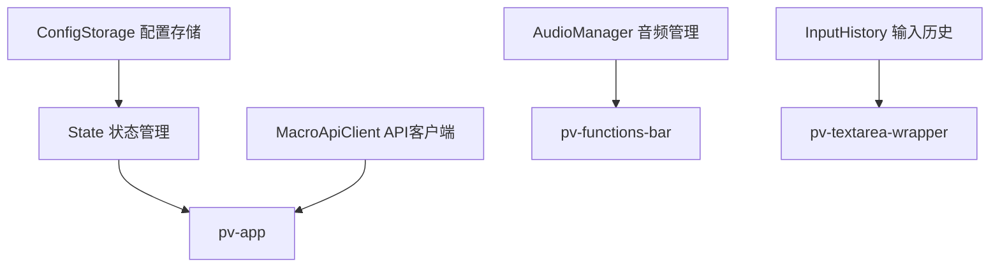
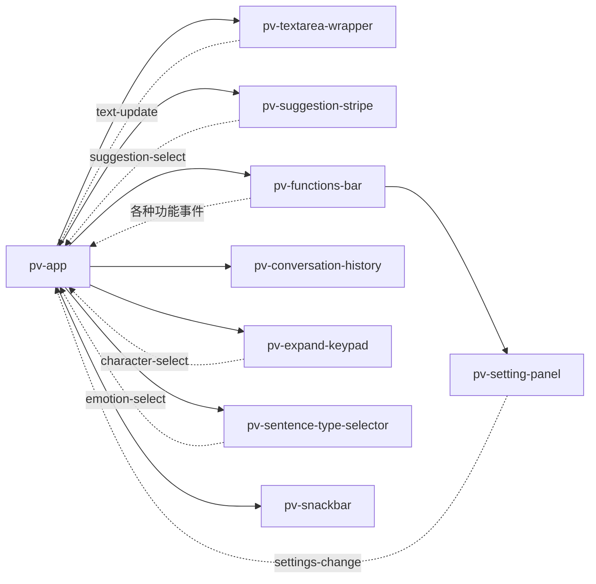
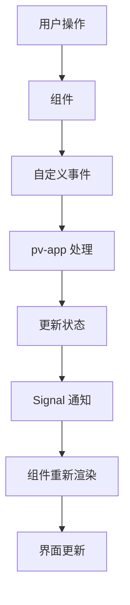

# Project VOICE 组件关系图

## 组件层次结构

```
pv-app (根组件)
├── pv-textarea-wrapper (文本输入区域)
│   └── pv-scalable-textarea (可伸缩文本区域)
├── pv-suggestion-stripe (建议显示条)
│   └── pv-button[] (建议按钮)
├── pv-functions-bar (功能按钮栏)
│   ├── md-icon-button[] (Material Design 图标按钮)
│   └── pv-setting-panel (设置面板)
├── pv-conversation-history (对话历史)
├── pv-expand-keypad (展开键盘)
│   ├── pv-fifty-key-keyboard (五十音键盘)
│   ├── pv-qwerty-keyboard (QWERTY键盘)
│   └── pv-single-row-keyboard (单行键盘)
├── pv-sentence-type-selector (句子类型选择器)
├── pv-character-input (字符输入)
└── pv-snackbar (消息提示)
```

## 组件依赖关系

### 1. 核心服务依赖


### 2. 组件通信关系


### 3. 状态流转关系


## 详细组件说明

### 1. pv-app (主应用组件)
**文件**: `src/pv-app.ts`
**职责**: 
- 应用的根组件和协调中心
- 管理全局状态和组件间通信
- 处理AI建议获取和文本处理

**关键属性**:
```typescript
@property({type: Object})
private state!: State;

@query('pv-textarea-wrapper')
private textField?: PvTextareaWrapper;

@query('pv-suggestion-stripe')
private suggestionStripe?: PvSuggestionStripe;

@query('pv-functions-bar')
private functionsBar?: PvFunctionsBar;
```

**事件处理**:
- `text-update`: 文本更新
- `suggestion-select`: 建议选择
- `character-select`: 字符选择
- `backspace-click`: 退格键
- `delete-click`: 删除键
- `undo-click`: 撤销操作

### 2. pv-textarea-wrapper (文本输入包装器)
**文件**: `src/pv-textarea-wrapper.ts`
**职责**:
- 封装文本输入区域
- 管理输入历史
- 处理文本更新事件

**关键功能**:
```typescript
setTextFieldValue(value: string, sources: InputSource[]) {
  this.textArea!.value = value;
  this.inputHistory.add(value, sources);
  this.dispatchEvent(new CustomEvent('text-update', {
    detail: value
  }));
}

textUndo() {
  const previous = this.inputHistory.undo();
  if (previous) {
    this.textArea!.value = previous.text;
  }
}
```

### 3. pv-suggestion-stripe (建议显示条)
**文件**: `src/pv-suggestion-stripe.ts`
**职责**:
- 显示AI生成的建议
- 处理建议选择和点击
- 支持单词和句子建议

**渲染逻辑**:
```typescript
render() {
  return html`
    <div class="words-container">
      ${this.words.map((word, index) => html`
        <pv-button 
          @click=${() => this.onSuggestionClick(word, index)}
          class="suggestion-word">
          ${word}
        </pv-button>
      `)}
    </div>
    <div class="sentences-container">
      ${this.sentences.map((sentence, index) => html`
        <pv-button 
          @click=${() => this.onSuggestionClick(sentence, index)}
          class="suggestion-sentence">
          ${sentence}
        </pv-button>
      `)}
    </div>
  `;
}
```

### 4. pv-functions-bar (功能按钮栏)
**文件**: `src/pv-functions-bar.ts`
**职责**:
- 提供应用功能按钮
- 语音播放控制
- 设置面板管理

**功能按钮**:
- 语音播放
- 复制文本
- 撤销操作
- 退格删除
- 完全删除
- 设置面板
- 语言切换
- 键盘切换

### 5. pv-expand-keypad (展开键盘)
**文件**: `src/pv-expand-keypad.ts`
**职责**:
- 动态加载不同类型的键盘
- 字符选择事件处理
- 键盘布局管理

**键盘类型**:
```typescript
const KEYBOARD_COMPONENTS = {
  'pv-fifty-key-keyboard': () => import('./keyboards/pv-fifty-key-keyboard.js'),
  'pv-qwerty-keyboard': () => import('./keyboards/pv-qwerty-keyboard.js'),
  'pv-single-row-keyboard': () => import('./keyboards/pv-single-row-keyboard.js'),
};
```

### 6. pv-setting-panel (设置面板)
**文件**: `src/pv-setting-panel.ts`
**职责**:
- 管理应用设置
- 语言配置
- 语音设置
- 界面偏好

**设置类别**:
- 语言选择
- 语音合成设置
- AI配置
- 界面布局
- 辅助功能

### 7. pv-conversation-history (对话历史)
**文件**: `src/pv-conversation-history.ts`
**职责**:
- 显示对话历史
- 历史消息管理
- 消息重用功能

### 8. 键盘组件系列

#### pv-fifty-key-keyboard (五十音键盘)
**文件**: `src/keyboards/pv-fifty-key-keyboard.ts`
**特点**:
- 日语五十音图布局
- 支持平假名和片假名
- 小文字和浊音处理

#### pv-qwerty-keyboard (QWERTY键盘)
**文件**: `src/keyboards/pv-qwerty-keyboard.ts`
**特点**:
- 标准QWERTY布局
- 支持大小写切换
- 数字和符号输入

#### pv-single-row-keyboard (单行键盘)
**文件**: `src/keyboards/pv-single-row-keyboard.ts`
**特点**:
- 简化的单行布局
- 适合辅助输入
- 最小化界面占用

## 事件系统

### 1. 自定义事件定义
```typescript
// 建议选择事件
export class SuggestionSelectEvent extends CustomEvent<[string, number]> {}

// 字符选择事件
export class CharacterSelectEvent extends CustomEvent<string> {}

// 文本更新事件
export class TextUpdateEvent extends CustomEvent<string> {}
```

### 2. 事件监听和处理
```typescript
// 在父组件中监听子组件事件
@query('pv-suggestion-stripe')
private suggestionStripe?: PvSuggestionStripe;

connectedCallback() {
  super.connectedCallback();
  this.addEventListener('suggestion-select', this.onSuggestionSelect);
  this.addEventListener('character-select', this.onCharacterSelect);
  this.addEventListener('text-update', this.onTextUpdate);
}
```

### 3. 事件冒泡和委托
```typescript
// 事件冒泡到父级处理
private onButtonClick(e: Event) {
  const target = e.target as HTMLElement;
  const action = target.dataset.action;
  
  this.dispatchEvent(new CustomEvent(action, {
    bubbles: true,
    detail: target.dataset.value
  }));
}
```

## 生命周期管理

### 1. 组件生命周期
```typescript
class PvComponent extends LitElement {
  // 组件连接到DOM
  connectedCallback() {
    super.connectedCallback();
    this.setupEventListeners();
    this.loadInitialData();
  }
  
  // 组件从DOM移除
  disconnectedCallback() {
    super.disconnectedCallback();
    this.cleanupEventListeners();
    this.cancelPendingRequests();
  }
  
  // 属性变化时触发
  updated(changedProperties: PropertyValues) {
    if (changedProperties.has('state')) {
      this.handleStateChange();
    }
  }
}
```

### 2. 资源管理
```typescript
// 请求取消管理
private abortController?: AbortController;

private async fetchData() {
  this.abortController?.abort();
  this.abortController = new AbortController();
  
  try {
    const response = await fetch(url, {
      signal: this.abortController.signal
    });
    // 处理响应
  } catch (error) {
    if (error.name !== 'AbortError') {
      console.error('Fetch error:', error);
    }
  }
}
```

## 性能优化

### 1. 虚拟滚动
```typescript
// 对于大量建议项的虚拟滚动
private renderSuggestions() {
  const visibleItems = this.getVisibleItems();
  return visibleItems.map(item => this.renderSuggestionItem(item));
}
```

### 2. 防抖处理
```typescript
// 防止频繁的API调用
private updateSuggestions = debounce(() => {
  this.fetchSuggestions();
}, 300);
```

### 3. 懒加载
```typescript
// 按需加载键盘组件
async loadKeyboard(keyboardType: string) {
  const module = await import(`./keyboards/${keyboardType}.js`);
  return module.default;
}
```

## 总结

Project VOICE 的组件架构采用了清晰的层次结构和事件驱动的通信模式。每个组件都有明确的职责分工，通过标准化的事件系统进行通信。这种设计使得系统具有良好的可维护性和可扩展性，同时也便于单独开发和测试各个组件。