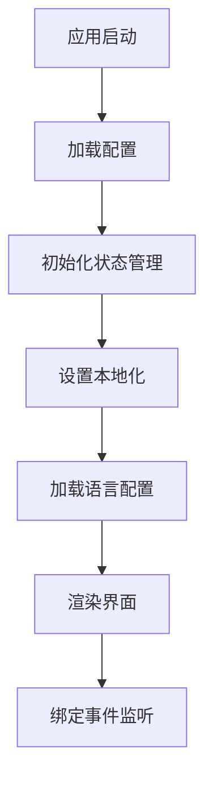
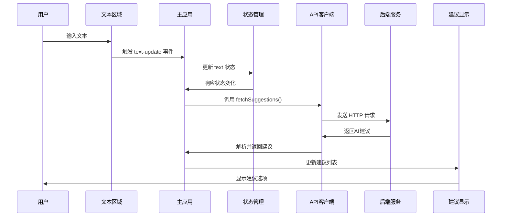
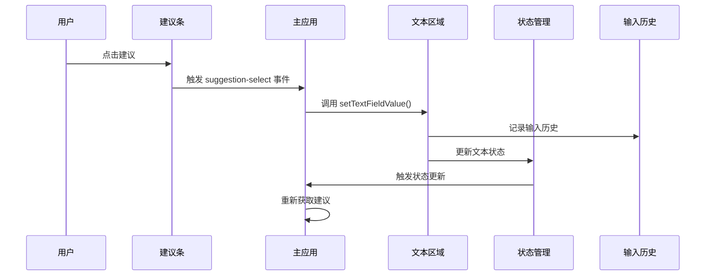
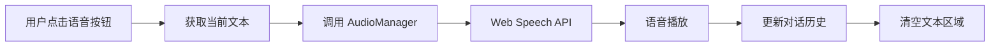
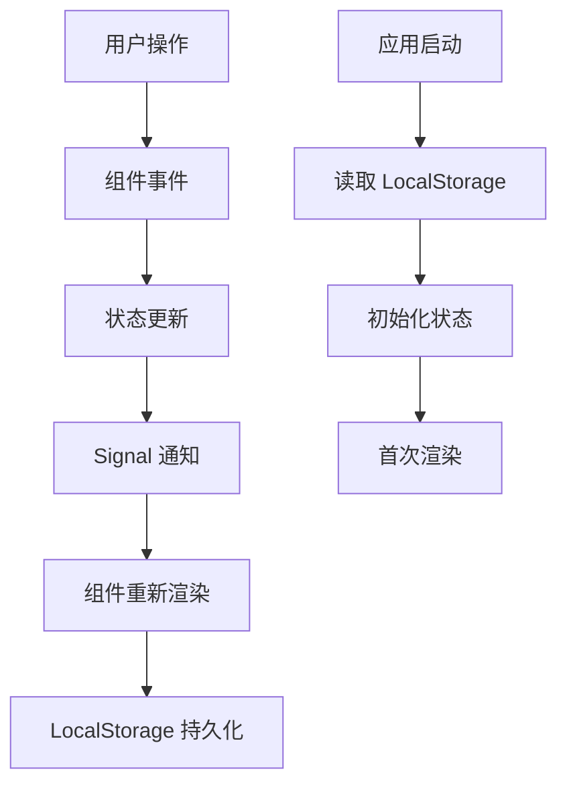
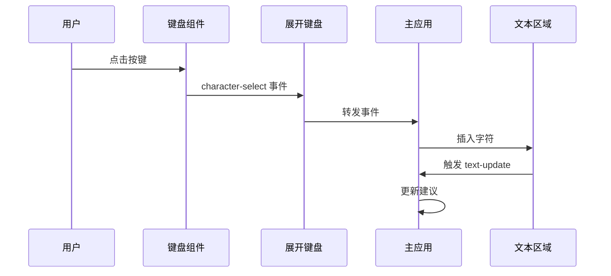
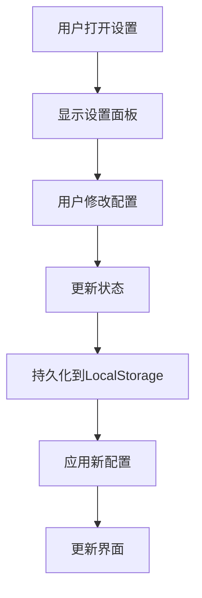
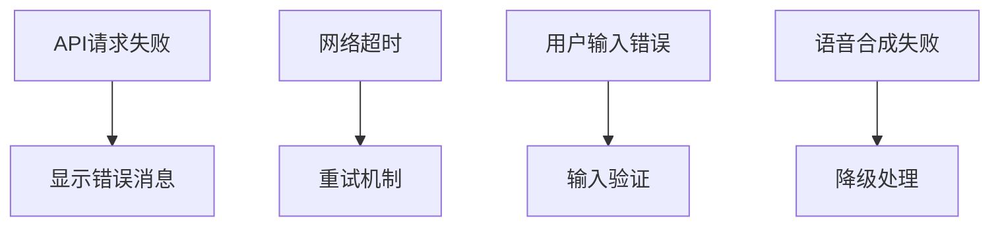

# Project VOICE 数据流详细说明

## 数据流核心架构

### 1. 应用初始化流程



**关键步骤**:
1. `connectedCallback()` 在 `pv-app.ts` 中被调用
2. 创建 `ConfigStorage` 实例管理持久化数据
3. 设置 `State` 对象的存储后端
4. 加载用户语言偏好和界面配置
5. 初始化键盘和输入系统

### 2. 文本输入和AI建议流程



**详细说明**:

#### 文本输入处理
```typescript
// pv-textarea-wrapper.ts
private handleTextUpdate() {
  const event = new CustomEvent('text-update', {
    detail: this.textArea?.value || ''
  });
  this.dispatchEvent(event);
}
```

#### 主应用响应
```typescript
// pv-app.ts
@query('pv-textarea-wrapper')
private textField?: PvTextareaWrapper;

private onTextUpdate(e: CustomEvent<string>) {
  this.state.text = e.detail;
  this.updateSuggestions();
}

private async updateSuggestions() {
  const textValue = this.state.text;
  if (textValue.length < MIN_MESSAGE_LENGTH) return;
  
  const suggestions = await this.macroApiClient.fetchSuggestions(
    textValue,
    this.state.lang.name,
    this.state.model,
    this.buildContext()
  );
  
  this.updateSuggestionStripe(suggestions);
}
```

#### API请求处理
```typescript
// macro-api-client.ts
async fetchSuggestions(textValue: string, language: string, model: string, context: Context) {
  const userInputs = {
    language,
    text: textValue,
    persona: context.persona,
    lastOutputSpeech: context.lastOutputSpeech,
    conversationHistory: context.conversationHistory,
    sentenceEmotion: context.sentenceEmotion,
  };

  // 并发请求单词和句子建议
  const [words, sentences] = await Promise.all([
    this.fetchSuggestion(userInputs, abortSignal, wordMacroId, model),
    this.fetchSuggestion(userInputs, abortSignal, sentenceMacroId, model)
  ]);

  return { words, sentences };
}
```

### 3. 建议选择和应用流程



**关键代码**:

#### 建议选择事件
```typescript
// pv-suggestion-stripe.ts
export class SuggestionSelectEvent extends CustomEvent<[string, number]> {}

private onSuggestionClick(suggestion: string, index: number) {
  this.dispatchEvent(new SuggestionSelectEvent('suggestion-select', {
    detail: [suggestion, index]
  }));
}
```

#### 主应用处理建议选择
```typescript
// pv-app.ts
@playClickSound()
private onSuggestionSelect(e: SuggestionSelectEvent) {
  const [value, index] = e.detail;
  this.textField?.setTextFieldValue(value, [
    {kind: InputSourceKind.SUGGESTED_SENTENCE, index}
  ]);
}
```

#### 文本区域更新
```typescript
// pv-textarea-wrapper.ts
setTextFieldValue(value: string, sources: InputSource[]) {
  this.textArea!.value = value;
  this.inputHistory.add(value, sources);
  this.state.text = value;
  this.dispatchEvent(new CustomEvent('text-update', {
    detail: value
  }));
}
```

### 4. 语音输出流程



**实现细节**:
```typescript
// pv-functions-bar.ts
private onOutputSpeechClick() {
  const text = this.textField?.value || '';
  if (text.trim()) {
    this.state.lastOutputSpeech = text;
    this.audioManager.speak(text);
    this.updateConversationHistory();
  }
}

// audio-manager.ts
speak(text: string) {
  const utterance = new SpeechSynthesisUtterance(text);
  utterance.voice = this.getSelectedVoice();
  utterance.rate = this.state.voiceSpeakingRate;
  utterance.pitch = this.state.voicePitch;
  
  utterance.onend = () => {
    this.dispatchEvent(new CustomEvent('tts-end'));
  };
  
  speechSynthesis.speak(utterance);
}
```

### 5. 状态管理数据流



**状态更新机制**:
```typescript
// state.ts
class State {
  private textSignal = signal('');
  
  get text() {
    return this.textSignal.get();
  }
  
  set text(newText: string) {
    this.textSignal.set(newText);
    // 自动触发依赖此状态的组件更新
  }
  
  private expandAtOriginSignal = signal(false);
  
  set expandAtOrigin(newExpandAtOrigin: boolean) {
    this.storage.write('expandAtOrigin', newExpandAtOrigin);
    this.expandAtOriginSignal.set(newExpandAtOrigin);
  }
}
```

### 6. 键盘输入处理



**键盘事件处理**:
```typescript
// pv-expand-keypad.ts
export class CharacterSelectEvent extends CustomEvent<string> {}

private onCharacterClick(char: string) {
  this.dispatchEvent(new CharacterSelectEvent('character-select', {
    detail: char
  }));
}

// pv-app.ts
private onCharacterSelect(e: CharacterSelectEvent) {
  const char = e.detail;
  const currentText = this.textField?.value || '';
  const newText = currentText + char;
  
  this.textField?.setTextFieldValue(newText, [InputSource.CHARACTER]);
}
```

### 7. 设置管理数据流



**配置更新流程**:
```typescript
// pv-setting-panel.ts
private onLanguageChange(selectedLanguages: string[]) {
  this.state.checkedLanguages = selectedLanguages;
  this.dispatchEvent(new CustomEvent('language-updated'));
}

private onVoiceSettingChange(rate: number, pitch: number, voice: string) {
  this.state.voiceSpeakingRate = rate;
  this.state.voicePitch = pitch;
  this.state.voiceName = voice;
}

// config-storage.ts
class ConfigStorage {
  write(key: string, value: any) {
    const fullKey = `${this.domainHead}.${key}`;
    localStorage.setItem(fullKey, JSON.stringify(value));
  }
  
  read(key: string): any {
    const fullKey = `${this.domainHead}.${key}`;
    const stored = localStorage.getItem(fullKey);
    return stored ? JSON.parse(stored) : this.defaultConfig[key];
  }
}
```

### 8. 组件间通信模式

#### 父子组件通信
```typescript
// 父组件传递数据给子组件
@property({type: Object})
private state!: State;

// 子组件通过事件向父组件通信
this.dispatchEvent(new CustomEvent('custom-event', {
  detail: data
}));
```

#### 兄弟组件通信
```typescript
// 通过共享状态进行通信
class ComponentA extends LitElement {
  @property({type: Object})
  private state!: State;
  
  private updateSharedState() {
    this.state.text = 'new value';
  }
}

class ComponentB extends SignalWatcher(LitElement) {
  @property({type: Object})
  private state!: State;
  
  render() {
    // 自动响应状态变化
    return html`${this.state.text}`;
  }
}
```

### 9. 错误处理和用户反馈



**错误处理实现**:
```typescript
// macro-api-client.ts
async fetchSuggestions(...args) {
  try {
    const response = await fetch(RUN_MACRO_ENDPOINT_URL, {
      method: 'POST',
      body: JSON.stringify(payload),
      signal: abortSignal
    });
    
    if (!response.ok) {
      throw new Error(`HTTP ${response.status}`);
    }
    
    return await response.json();
  } catch (error) {
    if (error.name === 'AbortError') {
      return null; // 请求被取消
    }
    
    // 显示错误消息
    this.showErrorMessage(error.message);
    return null;
  }
}
```

## 性能优化策略

### 1. 防抖处理
```typescript
// 防止频繁的API调用
private updateSuggestions = debounce(() => {
  this.fetchSuggestions();
}, 300);
```

### 2. 请求取消
```typescript
// 取消之前的请求
private fetchAbortController: AbortController | null = null;

async fetchSuggestions() {
  this.fetchAbortController?.abort();
  this.fetchAbortController = new AbortController();
  // ...
}
```

### 3. 组件懒加载
```typescript
// 按需加载组件
const keyboard = await import('./keyboards/pv-qwerty-keyboard.js');
```

## 总结

Project VOICE 的数据流设计遵循单向数据流原则，通过事件驱动的架构实现松耦合的组件通信。状态管理采用响应式设计，确保数据变化时界面的自动更新。整个系统的数据流清晰、可预测，便于维护和扩展。