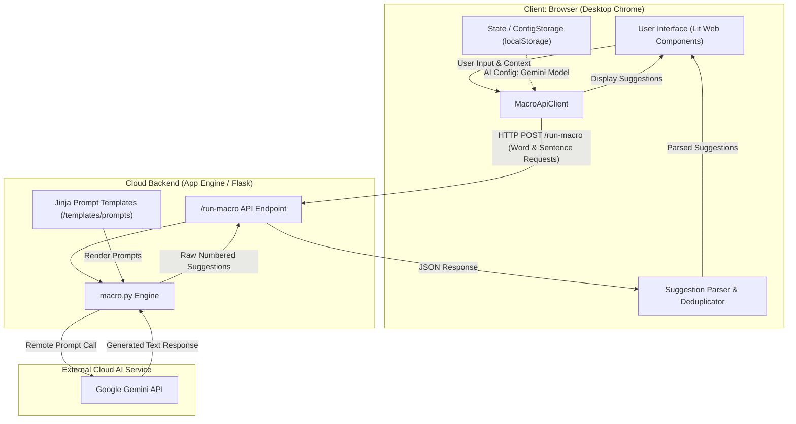
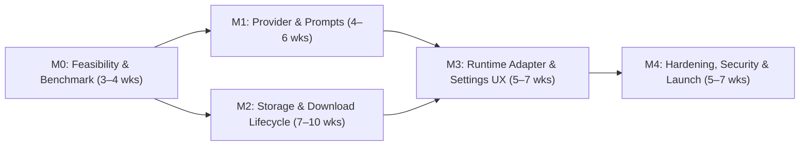

# On-Device LLM Suggestions for Project VOICE

**Status:** Implemented; deployment and real-device release gates remain operator responsibilities
**Last updated:** 2026-08-29

**Target release:** General Availability Release
**Overall status:** Code-complete with automated checks; recorded real-device evidence is currently limited to the M0 macOS run

**Contributor guide:**
[`docs/on-device-llm-maintenance.md`](./on-device-llm-maintenance.md) is the
current implementation map, ownership guide, and verification checklist.

## 1. Executive Summary

Project VOICE currently sends sentence-completion and word-completion requests from its Lit frontend to a Python backend. The backend renders Jinja prompt templates and calls the Gemini API.

This design adds an on-device inference path that runs entirely inside desktop Chrome:

- Cloud inference remains the default.
- Users can explicitly select **On-device** in Settings.
- A model can be downloaded directly from a private Google Cloud Storage bucket through a short-lived signed URL.
- The model is persisted in browser-managed storage and automatically loaded on later visits without being downloaded again.
- Development and debugging deployments can import an existing local model file.
- Once On-device mode is selected, word and sentence prompts, conversation context, and generated suggestions are not sent to Gemini or `/run-macro`.
- A local failure never triggers an automatic Cloud fallback. The user must explicitly select Cloud again.

The recommended runtime is Google LiteRT-LM for JavaScript using WebGPU. The first production-certified model is a web-compatible Gemma `.litertlm` artifact. The architecture provides an adapter interface for additional LiteRT model/runtime combinations, but does not claim that every arbitrary `.tflite` file can run as an LLM without model-specific support.

The initial release targets current stable desktop Chrome on macOS, Windows, and Linux where WebGPU is available. Full offline/PWA launch and Android Chrome certification are future improvements.

## 2. Context and Terminology

### 2.1 Product context

Project VOICE is a web-based augmentative and alternative communication application. It predicts words and sentences from partial user input so users can communicate with fewer input actions. Users may interact through keyboards, eye tracking, switch access, or other accessibility tools, so UI responsiveness and predictable failure behavior are particularly important.

The current suggestion flow is:



The frontend currently starts two requests for each suggestion update:

- A word-completion request.
- A sentence-completion request.

The Python backend inserts the user input, language, persona, conversation history, and sentence intent into a prompt template. It then sends the rendered prompt to Gemini and returns generated text to the browser.

Relevant current components are:

- `pv-app`: gathers input and conversation context and updates suggestion UI.
- `MacroApiClient`: sends suggestion requests to `/run-macro` and parses numbered-list responses.
- Python `macro.py`: renders prompts and calls Gemini.
- Jinja templates under `templates/prompts`: define language-specific word and sentence instructions.
- `State` and `ConfigStorage`: keep user configuration, including the currently selected Gemini configuration, in browser `localStorage`.

The current `aiConfig` value combines Cloud model selection with language-specific prompt selection. On-device support requires provider selection, model selection, and prompt selection to become separate concerns.

### 2.2 Current technology dependencies

**Lit** is the TypeScript web-component framework used by the Project VOICE frontend. It renders the Settings UI, input controls, loading states, and suggestions.

**Python and Flask** provide the current web server and `/run-macro` endpoint. Under this design they continue to serve the app and Cloud inference, and add model-manifest and signed-download-URL endpoints.

**Jinja** is the Python template engine used by the backend to create prompts. Project VOICE stores its prompts in `.jinja2` files containing variables and conditional sections.

**Gemini** is Google’s hosted generative AI service used by the current backend. Project VOICE accesses Gemini through an API; Gemini model weights are not downloaded into the browser.

**Google Cloud Storage (GCS)** is Google Cloud’s object-storage service. This design uses a private GCS bucket to distribute large model artifacts directly to Chrome.

### 2.3 Cloud and on-device inference

**Inference** is the process of running an already-trained model to produce an output. In Project VOICE, inference means providing partial user text and conversation context to a language model and generating likely word and sentence completions.

Inference does not include training or fine-tuning. This design assumes the required model weights already exist either on a developer machine or in the project’s GCS bucket.

**Cloud inference** runs the model on a remote service. The existing Gemini flow is Cloud inference because the browser sends suggestion data to the Python backend, which calls Gemini.

**On-device inference**, also called **local inference**, runs the model using the user’s own computer. In this design, the runtime executes inside Chrome. Prompt content and generated suggestions do not need to leave the browser.

“On-device” does not mean the entire Web app is offline in v1. Chrome may still contact Project VOICE to load application assets, retrieve model metadata, check whether a manual update is available, or download a model. After model installation, however, all word and sentence inference is local.

### 2.4 Language models, Gemma, and model weights

A **large language model (LLM)** is a model that processes and generates text. Models intended for local devices are usually smaller or more heavily quantized than cloud-hosted models.

**Model weights** are the trained numerical parameters of a model. They are commonly stored in files ranging from hundreds of megabytes to several gigabytes. Training produces the weights; inference reads them.

**Gemma** is Google’s family of open-weight language models. Unlike Gemini, compatible Gemma weights can be packaged and distributed so applications can run them locally.

The first production-certified on-device model in this design is an instruction-tuned Gemma model packaged as a web-compatible `.litertlm` artifact.

### 2.5 LiteRT, LiteRT.js, and LiteRT-LM

**LiteRT**, formerly TensorFlow Lite, is Google’s model-runtime and model-format ecosystem for executing machine-learning models on local hardware. It provides low-level operations for loading a compatible model, executing its computation graph, and using available hardware acceleration.

A conventional LiteRT artifact commonly uses the `.tflite` extension.

**LiteRT.js** is the JavaScript interface for executing compatible LiteRT models in browser environments. It can run compatible `.tflite` computation graphs using supported browser accelerators. It is a low-level runtime and does not make every arbitrary `.tflite` file usable as an LLM.

A complete LLM pipeline additionally requires:

- A compatible tokenizer.
- A model-specific chat or prompt format.
- A token-by-token decoding loop.
- Key-value cache management.
- Sampling logic.
- Conversion from generated token IDs back into text.

**LiteRT-LM** is a higher-level framework that supplies this language-model orchestration around LiteRT execution.

**LiteRT-LM Web** is its JavaScript/TypeScript browser API. The npm package used by this design is `@litert-lm/core`. It loads web-compatible model artifacts, creates conversations, generates or streams text, supports cancellation, and uses WebGPU for acceleration.

A **`.litertlm` file** is a model package intended for LiteRT-LM. A `.litertlm` extension alone does not guarantee Chrome compatibility: the artifact must contain the model metadata and compiled resources expected by the Web runtime. As of this document, the official Web API is an early preview and certifies only a limited set of web-compatible Gemma artifacts. [LiteRT-LM Web API](https://developers.google.com/edge/litert-lm/js)

The relationship is:

```text
LiteRT
  └── Low-level local model execution

LiteRT.js
  └── Low-level LiteRT execution in JavaScript/browser environments

LiteRT-LM
  └── LLM orchestration built around LiteRT

@litert-lm/core
  └── LiteRT-LM browser API used by Project VOICE

Gemma .litertlm
  └── A Gemma model packaged for the LiteRT-LM runtime
```

### 2.6 Tokens, tokenization, generation, and sampling

An LLM does not directly process characters or words. It processes **tokens**, which are numeric identifiers representing text fragments.

A **tokenizer** converts prompt text into token IDs understood by the model and converts generated token IDs back into readable text. Different models can require different tokenizers. A model can load successfully but still produce invalid output if it is paired with the wrong tokenizer.

**Generation** repeatedly predicts and selects the next token until the model emits a stop token or reaches a configured limit.

**Sampling** controls how the next token is selected. Parameters used in this design include:

- `temperature`: controls randomness; lower values are more deterministic.
- `topP`: restricts selection to a probable subset of tokens.
- `maxOutputTokens`: caps the length of generated output.

**Tokens per second** is a runtime throughput metric. It describes speed, not suggestion quality.

### 2.7 Prompt templates

A **prompt** is the instruction and context provided to an LLM. Project VOICE prompts may include:

- Partial user input.
- Requested number of suggestions.
- Language.
- Persona.
- Recent conversation history.
- Last user and partner speech.
- Sentence emotion or intent.
- Required output format.

A **prompt template** contains variables and conditional sections that are filled at runtime. Project VOICE currently renders prompts on the backend using Jinja.

Local inference requires equivalent browser-side rendering. This design keeps the existing `.jinja2` files as the canonical prompt source, bundles them with the frontend, and adds golden tests that compare Python and browser rendering.

### 2.8 KV cache

A **key-value cache (KV cache)** stores intermediate attention data generated while an LLM processes tokens. Reusing this data prevents the model from recalculating the entire prompt for every new output token.

KV caches can consume substantial RAM or GPU memory. Their size depends on model architecture and context length. This is one reason v1 serializes local word and sentence generations instead of creating two simultaneous model sessions.

### 2.9 WebGPU

**WebGPU** is a browser API that exposes modern GPU computation to Web applications. LiteRT-LM Web uses it to accelerate inference.

WebGPU availability is not guaranteed merely because the browser is Chrome. It also depends on the operating system, GPU, graphics driver, and browser policy. Project VOICE must feature-detect `navigator.gpu`, request an adapter and device, and handle initialization or device-loss failures.

If WebGPU is unavailable, Local mode is unavailable. Project VOICE does not automatically send the request to Gemini. [Chrome WebGPU documentation](https://developer.chrome.com/docs/web-platform/webgpu/)

### 2.10 How LiteRT-LM and WebGPU work together

LiteRT-LM and WebGPU serve different layers of the local inference stack:

- **LiteRT-LM** owns the language-model workflow: reading the model package, applying the model’s tokenizer and chat format, managing conversations and KV caches, scheduling generation, sampling tokens, streaming text, and cancelling work.
- **LiteRT** executes the model’s tensor operations.
- **WebGPU** is the browser interface used to submit supported tensor computation to the GPU.
- **Chrome’s WebGPU implementation** translates WebGPU commands through its GPU stack to the operating system’s native graphics API and GPU driver. The exact native backend is platform-dependent, such as Metal, Direct3D 12, or Vulkan.

The conceptual runtime stack is:

```text
Project VOICE Inference Worker
    ↓
@litert-lm/core JavaScript API
    ↓
LiteRT-LM orchestration and LiteRT execution
    ├── Tokenizer, conversation, sampling, and streaming control
    ├── WebAssembly/runtime support on CPU
    └── WebGPU tensor operations
            ↓
       Chrome WebGPU implementation
            ↓
       OS graphics/compute API and GPU driver
            ↓
           GPU
```

The exact division of individual operations between JavaScript, WebAssembly, CPU, and GPU is an implementation detail of the pinned LiteRT-LM release and selected model artifact. Project VOICE relies on the public LiteRT-LM API and does not assume that every operation runs on the GPU.

#### Model loading

1. `ModelManager` opens the verified `.litertlm` file from OPFS as a browser `File`/`Blob` or readable stream.
2. The Inference Worker passes that object to `Engine.create()` from `@litert-lm/core`.
3. LiteRT-LM reads package metadata, model graphs, tokenizer resources, chat-template metadata, and Web-runtime artifacts.
4. The runtime requests a WebGPU adapter and logical device from Chrome.
5. LiteRT-LM/LiteRT prepares the model for the selected WebGPU device. This can include creating GPU buffers, uploading or mapping model data, and compiling WebGPU compute pipelines.
6. The engine reports `ready` only after initialization succeeds. The adapter creates an isolated conversation for each word or sentence generation request.

Initialization can take several seconds even when the model is already downloaded because browser persistence and runtime memory are separate. OPFS prevents another network download, but the runtime still has to open the artifact and prepare CPU/GPU resources during each new browser session.

The implementation must not promise that the whole model is copied into dedicated GPU memory. Integrated GPUs often share system memory, browsers may stage data through CPU memory, and the runtime may partition or stream resources. The application treats memory placement as implementation-dependent.

#### Prompt prefill

When Project VOICE requests a suggestion:

1. `LocalSuggestionProvider` renders a word or sentence prompt in the browser.
2. The adapter creates an isolated LiteRT-LM conversation and sends the prompt to it.
3. LiteRT-LM applies the model’s chat format and tokenizer, converting prompt text into token IDs.
4. The runtime executes the model over the complete input sequence. This phase is called **prefill**.
5. Transformer operations such as matrix multiplication, attention, and normalization are dispatched to compatible WebGPU compute pipelines.
6. The model produces next-token scores, commonly called **logits**, and builds the initial KV cache.

Prefill cost increases with prompt length. Project VOICE prompts containing persona or conversation history may therefore have higher latency and memory use than short prompts.

#### Autoregressive decode

After prefill, LiteRT-LM enters an autoregressive decode loop:

1. Sampling logic selects a token from the latest logits using settings such as `temperature` and `topP`.
2. The selected token is appended to the generated sequence.
3. The runtime executes the model for the new token while reusing the KV cache instead of recomputing the full prompt.
4. The tokenizer converts completed token fragments back to text.
5. `sendMessageStreaming()` yields text chunks to the Inference Worker.
6. The Worker forwards partial output to `LocalSuggestionProvider`, which parses and publishes suggestions.
7. The loop ends on a stop token, cancellation, model error, or `maxOutputTokens`.

The data flow is:

```text
Rendered prompt
    ↓ tokenizer
Input token IDs
    ↓ prefill on LiteRT/WebGPU
Initial logits + KV cache
    ↓ repeated decode steps
Output token IDs
    ↓ detokenizer
Streaming text chunks
    ↓ Project VOICE parser
Word or sentence suggestions
```

#### Cancellation and cleanup

When newer input makes an active request stale, Project VOICE calls the LiteRT-LM conversation cancellation API and immediately marks the old request ID as invalid. Invalidating the request ID prevents late chunks from reaching the UI even if GPU work already submitted to Chrome cannot stop immediately.

Deleting a conversation releases its request-specific state and KV cache. Deleting the engine releases runtime and GPU resources associated with the loaded model. The OPFS model file remains installed unless the user explicitly removes it.

Chrome can report a lost WebGPU device because of a driver reset, GPU process restart, resource exhaustion, or browser policy. Project VOICE treats device loss as a Local runtime error, disposes the failed engine, and offers an explicit reload. It never changes to Cloud automatically.

#### Storage and memory are different resource layers

| Resource | Purpose | Lifetime |
|---|---|---|
| OPFS model file | Persistent downloaded artifact | Survives normal reloads and restarts |
| JavaScript/Wasm and system memory | Runtime metadata, tokenizer state, staging buffers, and browser bookkeeping | Released when Worker/engine is disposed or the page closes |
| WebGPU buffers | Model tensors and intermediate computation available to the GPU | Recreated when the engine loads and released on disposal/device loss |
| KV cache | Per-generation attention state | Released when the conversation is deleted |
| IndexedDB record | Installed version, checksum, status, and rollback metadata | Survives normal reloads and restarts |

This distinction explains why a model is downloaded once but still needs to be loaded on every app session, and why local inference uses CPU and RAM even though WebGPU performs the main accelerated computation.

#### Why a web-compatible model artifact is required

WebGPU is not a general loader for native model binaries. LiteRT-LM Web needs an artifact whose operators, tensor layouts, tokenizer, metadata, and compiled resources match the Web runtime. A model packaged for Android, a native desktop backend, or another LiteRT-LM version may fail during initialization even if it has the `.litertlm` extension.

For this reason, certification tests the complete tuple of:

```text
Project VOICE version
+ @litert-lm/core version
+ Chrome/WebGPU environment
+ model artifact and checksum
```

The manifest and runtime adapter enforce this compatibility boundary.

### 2.11 WebAssembly

**WebAssembly (Wasm)** is a binary instruction format that allows code written in languages such as C++ or Rust to run efficiently inside a browser sandbox.

LiteRT-LM may use Wasm for runtime operations that do not execute directly through WebGPU. The LiteRT-LM JavaScript package and its Wasm resources are bundled with Project VOICE rather than loaded from a third-party CDN.

### 2.12 Web Workers

A **Web Worker** runs JavaScript in a background browser thread separate from the page’s main UI thread.

The inference Worker owns:

- LiteRT-LM initialization.
- Model loading and disposal.
- Prompt-generation requests.
- Output streaming and cancellation.
- Model-file hashing.
- Runtime performance measurements.

Moving this work into a Worker prevents inference and multi-gigabyte file operations from blocking typing, switch access, focus handling, or screen-reader interaction.

### 2.13 Runtime adapters and certified models

A **runtime adapter** is an application-owned implementation that connects Project VOICE’s generic suggestion interface to a particular model runtime and artifact contract.

An adapter validates model metadata, loads the artifact, runs generation, streams and cancels output, releases resources, and reports metrics.

The first adapter is `litert-lm`, supporting certified web-compatible `.litertlm` artifacts. A future adapter could support a specific raw `.tflite` LLM architecture using LiteRT.js, but would need explicit tokenizer, tensor-layout, KV-cache, decoding, and sampling support.

A **certified model** is a model/version combination tested for:

- Artifact and runtime compatibility.
- Successful loading on supported Chrome environments.
- Correct tokenizer and prompt behavior.
- Memory and storage requirements.
- Output formatting and parsing.
- Latency and stability.

Model manifests may name an adapter compiled into Project VOICE. They cannot provide executable JavaScript, Wasm, or arbitrary remote code.

### 2.14 Suggestion providers

A **suggestion provider** is the application layer that produces word and sentence suggestions.

This design introduces:

- `CloudSuggestionProvider`, which uses `/run-macro` and Gemini.
- `LocalSuggestionProvider`, which uses the browser prompt renderer and LiteRT-LM Worker.
- `SuggestionProviderRouter`, which chooses exactly one provider from the user’s `inferenceMode`.

Separating provider selection from model selection prevents a Gemini model setting from also controlling whether user data is sent to the Cloud.

### 2.15 Model manifest

A **model manifest** is a small JSON document describing a model artifact. It is configuration data, not executable code.

It contains:

- Stable model ID and version.
- Display name and model family.
- Required runtime adapter.
- Artifact format and size.
- SHA-256 checksum.
- Supported languages and context limits.
- Hardware and storage requirements.
- Generation defaults.
- Immutable GCS object generation.

The manifest lets the application reject incompatible artifacts before loading them and determine whether a manual update is available.

### 2.16 Signed URLs, CORS, and Range requests

A **signed URL** is a time-limited URL granting permission to read a specific private GCS object. Chrome downloads the model directly from GCS so the multi-gigabyte file does not pass through the Python server.

**Cross-Origin Resource Sharing (CORS)** is the browser mechanism controlling whether one origin can fetch resources from another. The GCS bucket must allow the Project VOICE production and development origins to download bytes and inspect required response headers.

An HTTP **Range request** requests only a specified portion of a file. It allows an interrupted multi-gigabyte model download to continue from the recorded byte offset instead of restarting.

The signed URL is pinned to an immutable GCS object generation so a resumed download cannot combine bytes from two artifact versions.

### 2.17 SHA-256 integrity verification

**SHA-256** is a cryptographic hash algorithm that produces a fixed digest for a file. The expected digest is stored in the model manifest.

After download or import, Project VOICE streams the local artifact through SHA-256 and compares it with the expected value. A mismatch means the file is incomplete, corrupted, or not the expected artifact. The candidate is rejected before inference.

Hashing runs in a Worker and does not require an additional in-memory copy of the complete model.

### 2.18 OPFS, IndexedDB, and localStorage

**Origin Private File System (OPFS)** is a browser-managed file system private to a Web origin. It supports large files, streaming writes, random access, and efficient Worker IO. This design stores model artifacts and partial downloads in OPFS. [OPFS documentation](https://web.dev/articles/origin-private-file-system)

**IndexedDB** is a transactional browser database. It stores model metadata, download offsets, active versions, and last-known-good records.

**localStorage** is a small synchronous key-value store. It continues to store user preferences such as `inferenceMode`, but is not suitable for model bytes.

All three are scoped to the exact scheme, hostname, and port. Changing the application origin creates a different storage area.

Model files survive normal reloads and browser restarts, but persistence is not absolute:

- `navigator.storage.persist()` requests protection against automatic eviction.
- The browser may deny that request.
- Clearing site data deletes OPFS and IndexedDB.
- Incognito storage is temporary.
- Changing the application origin requires a new download.

### 2.19 Browser storage quota

A **storage quota** is the disk space a browser permits an origin to use. `navigator.storage.estimate()` reports approximate usage and quota.

Project VOICE checks available space before downloading. A model update normally needs enough space for both the installed model and the candidate version so the application can roll back safely.

### 2.20 Web Locks and BroadcastChannel

**Web Locks** provide cross-tab mutual exclusion. Project VOICE uses a lock to prevent multiple tabs from downloading or updating the same model simultaneously.

**BroadcastChannel** allows same-origin tabs to exchange lifecycle and download-status messages.

These APIs do not share a loaded GPU model between tabs. Shared cross-tab inference is a possible future improvement.

### 2.21 Cross-origin isolation, COOP, COEP, and CSP

**Cross-origin isolation** is a browser security mode required by some high-performance capabilities, including reliable Wasm threading and page-level memory measurement.

It is enabled with:

- `Cross-Origin-Opener-Policy: same-origin` (**COOP**).
- `Cross-Origin-Embedder-Policy: require-corp` (**COEP**).

These headers restrict how the page interacts with cross-origin windows and resources. Project VOICE bundles runtime dependencies and self-hosts Wasm/Worker assets (`/static/vendor/litert-lm/wasm/`), while external Google Fonts are loaded via Google Fonts CDN with `crossorigin="anonymous"` and scoped CSP directives. [Cross-origin isolation guidance](https://web.dev/articles/coop-coep)

**Content Security Policy (CSP)** restricts where scripts, Workers, and network requests may originate. It reduces the risk that an injection vulnerability could read local prompts or model data.

### 2.22 CSRF

**Cross-Site Request Forgery (CSRF)** is an attack in which another site causes a user’s browser to make an unwanted authenticated request. Project VOICE already uses CSRF protection for `/run-macro`. The signed-download-URL endpoint must use the same session and CSRF controls.

### 2.23 CPU and RAM reporting limitations

A normal Web page cannot read exact system-wide CPU, RAM, or GPU-memory use. Available approximations include:

- `navigator.hardwareConcurrency`: logical CPU count.
- `navigator.deviceMemory`: coarse device-memory class.
- `performance.measureUserAgentSpecificMemory()`: estimated memory associated with the page and related Workers.
- Worker timing: idle or active inference state and rolling duty cycle.
- Runtime metrics: latency and tokens per second.
- Storage APIs: model disk usage and browser quota.

The UI must label these values accurately. For example, inference duty cycle is shown as **Model activity**, not OS CPU usage. Page memory is an implementation-dependent estimate and may omit GPU allocations. [Chrome memory measurement guidance](https://web.dev/articles/monitor-total-page-memory-usage)

### 2.24 PWA and Service Worker

A **Progressive Web App (PWA)** can provide installation and offline-launch behavior.

A **Service Worker** runs separately from the page and can cache application assets and intercept network requests.

V1 persists the model and performs inference locally, but does not guarantee offline application launch. Adding a Service Worker and full PWA asset lifecycle is a low-priority future improvement.

### 2.25 Dependency summary

```text
Lit
  UI components and application state

Python / Flask
  Existing Web server, Cloud inference, model catalog, signed URLs

Jinja
  Existing prompt-template format

Browser prompt renderer
  Renders the same prompt sources for Local inference

Gemini API
  Existing Cloud suggestion provider

Gemma
  First on-device model family

LiteRT
  Underlying Google edge model runtime

LiteRT.js
  Low-level browser execution for compatible LiteRT models

LiteRT-LM / @litert-lm/core
  Browser LLM generation runtime selected for v1

WebGPU
  GPU acceleration for local inference

WebAssembly
  Efficient browser execution for supporting runtime operations

Web Worker
  Background model loading and inference orchestration

OPFS
  Persistent storage for large model files

IndexedDB
  Transactional model metadata and lifecycle state

GCS
  Private remote storage for model artifacts

Signed URL
  Temporary direct-download authorization

COOP / COEP
  Cross-origin isolation and access to required browser capabilities
```

## 3. Goals, Non-goals, and User Journey

### 3.1 Goals

- Let users choose between `Cloud` and `On-device`, with `Cloud` as the default.
- Run all word and sentence generation locally after On-device mode is selected.
- Support current desktop Chrome on macOS, Windows, and Linux where WebGPU is available.
- Support a web-compatible Gemma `.litertlm` model in v1.
- Provide an extensible adapter contract for additional certified LiteRT model formats.
- Download models from a private GCS bucket without proxying model bytes through App Engine.
- Persist downloaded models across reloads and browser restarts.
- Load a downloaded model automatically.
- Support resumable downloads, integrity checking, manual updates, and development-only local imports.
- Show model state, storage use, approximate page memory, device capability, inference activity, latency, and tokens per second.
- Preserve the existing Cloud behavior.

### 3.2 Non-goals

- Model training or fine-tuning.
- Model quantization, conversion, or packaging.
- Supporting arbitrary raw `.tflite` files without a compatible built-in adapter.
- Exact OS-level CPU, RAM, or GPU-memory monitoring.
- Automatic fallback from Local to Cloud.
- Automatic model updates or downloads.
- Full offline/PWA launch in v1.
- Android Chrome certification in v1.
- Guaranteeing model persistence after site-data deletion, Incognito exit, origin changes, or denied persistent storage.
- Guaranteeing semantic parity between a small local Gemma model and Gemini.

### 3.3 Critical user journey

1. The user opens Project VOICE in desktop Chrome.
2. The user opens Settings and selects **On-device**.
3. Project VOICE immediately stops Cloud suggestion requests.
4. The UI detects browser/runtime compatibility and displays the configured model and download requirements.
5. The user presses **Download model**.
6. Chrome downloads the model directly from private GCS, shows progress, verifies integrity, and stores it in OPFS.
7. The app automatically loads the verified model and reports **Ready**.
8. All subsequent word and sentence suggestions are generated locally.
9. On later visits, the app loads the installed model from OPFS without downloading it again.
10. The model is replaced only when the user explicitly presses **Update**, imports a replacement in debug mode, removes site data, or removes the model.

## 4. Requirements and Assumptions

### 4.1 Functional requirements

- Settings exposes separate Cloud and On-device sources.
- Cloud is the default for new and existing users.
- The existing Gemini model selector remains available under Cloud.
- Ordinary users see one administrator-configured Local model in v1.
- Local mode is usable only after capability checks and model loading succeed.
- Local mode never calls `/run-macro` or Gemini.
- Model download supports progress, cancellation, interruption, resume, verification, and retry.
- A successful download automatically starts model loading.
- A verified model remains available after reload and browser restart.
- Update discovery may be automatic, but model-byte download is always manual.
- Failed updates preserve the last-known-good model.
- Development/debug deployments support local `.litertlm` import.
- Resource status is based only on Web APIs and is clearly labeled as approximate.

### 4.2 Assumptions

- The project supplies an instruction-tuned, web-compatible Gemma `.litertlm` artifact and satisfies its license and distribution terms.
- The production model is stored as an immutable, generation-pinned GCS object.
- The deployment uses HTTPS.
- Target users have current stable desktop Chrome and a working WebGPU adapter.
- One administrator-configured model is sufficient for the initial user experience.
- The runtime package and model version are pinned and rolled forward independently.
- Full offline launch is desirable but lower priority than private local inference and model persistence.

## 5. Design Decisions

### 5.1 Runtime and compatibility contract

Use `@litert-lm/core`, pinned to an exact tested release, with WebGPU execution in a dedicated Worker.

The v1 production support contract is:

```text
adapterId: litert-lm
format: litertlm
family: Gemma
artifact: explicitly certified web-compatible build
backend: WebGPU
```

“Support LiteRT models” means the application can add built-in adapters without changing routing, storage, download, or Settings architecture. It does not mean every file bearing a `.tflite` or `.litertlm` extension works automatically.

Unknown adapter IDs, tensor layouts, tokenizers, and executable manifest content are rejected.

### 5.2 Provider abstraction

Introduce a provider-neutral contract:

```ts
type InferenceMode = 'cloud' | 'local';

interface SuggestionRequest {
  text: string;
  language: string;
  sentencePromptId: string;
  wordPromptId: string;
  persona: string;
  lastInputSpeech: string;
  lastOutputSpeech: string;
  conversationHistory: string;
  sentenceEmotion: string;
  count: number;
}

interface SuggestionResult {
  sentences: string[];
  words: string[];
  provider: 'cloud' | 'local';
  modelId: string;
  modelVersion?: string;
}

interface SuggestionProvider {
  generate(
    request: SuggestionRequest,
    signal: AbortSignal,
    onPartial?: (partial: Partial<SuggestionResult>) => void,
  ): Promise<SuggestionResult>;
}
```

Implementations are:

- `CloudSuggestionProvider`: wraps the current `/run-macro` flow.
- `LocalSuggestionProvider`: renders prompts locally and communicates only with the inference Worker.
- `SuggestionProviderRouter`: selects exactly one provider from `inferenceMode`.

No provider or router contains automatic Cloud fallback logic.

### 5.3 Prompt rendering

Use the existing `.jinja2` templates as the single prompt source:

- Bundle required prompt sources as text during the frontend build.
- Render them with a restricted Jinja-compatible browser renderer configured to match current Python behavior.
- Reproduce Japanese space substitution, the `§` workaround, response cleanup, and numbered-list parsing in the Local path.
- Add golden tests comparing Python and browser rendering for every prompt and conditional branch.

The Cloud path continues rendering prompts in Python. This avoids adding a backend endpoint that accepts arbitrary client-supplied Gemini prompts.

### 5.4 Generation scheduling

Retain separate word and sentence prompts in v1 to preserve current behavior and quality.

- Maintain one Local generation queue per tab.
- Cancel the active conversation when a newer request arrives.
- Keep only the newest queued request.
- Generate the shorter word request first and publish it through `onPartial`.
- Generate sentence suggestions second.
- Use isolated conversations so previous requests do not contaminate later prompts.
- Tag every request with a sequence number and discard stale output even if runtime cancellation is delayed.
- Never retry a failed request through Cloud.

A combined word-and-sentence JSON prompt is deferred until benchmarks demonstrate acceptable quality and latency.

### 5.5 Persistence

Use:

- `localStorage` for small user preferences.
- IndexedDB for transactional model metadata and lifecycle state.
- OPFS for model artifacts and partial downloads.

Request persistent storage only from an explicit Download or Import action. Clearly state that user-cleared site data still removes the model.

### 5.6 Model distribution

Use private GCS plus a backend-generated signed URL:

- The backend authenticates and authorizes the model request.
- The backend signs only allowlisted model IDs and versions.
- Chrome downloads directly from GCS.
- The URL is pinned to an immutable GCS object generation.
- Interrupted downloads resume through Range requests.
- Signed URLs are refreshed when needed and never persisted or logged in full.

## 6. Architecture and Data Flow

```mermaid
flowchart TD
    subgraph Browser["Client Browser (Desktop Chrome - Cross-Origin Isolated)"]
        subgraph MainThread["Main UI Thread"]
            UserUI["User Interface & AAC Input (Lit Components)"]
            Settings["Settings Panel (Cloud vs On-Device Selection)"]
            Router["SuggestionProviderRouter"]
            CloudProvider["CloudSuggestionProvider"]
            LocalProvider["LocalSuggestionProvider"]
            PromptRenderer["In-Browser Jinja Prompt Renderer"]
            ModelMgr["ModelManager (State Machine)"]
            ParserLocal["Suggestion Parser & Normalizer"]
        end

        subgraph WorkerThread["Inference Web Worker (Dedicated Thread)"]
            WorkerController["Worker Protocol Controller"]
            RuntimeAdapter["LiteRT-LM ModelRuntimeAdapter"]
            Engine["LiteRT-LM Core Engine (@litert-lm/core)"]
            Tokenizer["Model Tokenizer & KV Cache Manager"]
            Hasher["Streaming SHA-256 Verifier"]
        end

        subgraph ClientStorage["Browser Storage Layer"]
            LS["localStorage (inferenceMode Preference)"]
            IDB["IndexedDB (Version, Checksum, Offset, LKG Metadata)"]
            OPFS["OPFS: Origin Private File System (.litertlm Model Files)"]
        end

        subgraph WebHardware["Hardware Acceleration"]
            WebGPU["WebGPU API"]
            OS_GPU["OS Graphics Driver & GPU (Direct3D / Metal / Vulkan)"]
        end
    end

    subgraph CloudInfra["Backend & Cloud Infrastructure"]
        FlaskBackend["App Engine / Flask Backend"]
        ManifestAPI["GET /api/on-device-models/default"]
        SigningAPI["POST /api/on-device-models/{id}/download-url"]
        RunMacro["POST /run-macro (Cloud Mode Only)"]
        GeminiService["Google Gemini API"]
        PrivateGCS["Private Google Cloud Storage (Immutable Model Artifacts)"]
    end

    %% UI and Mode Routing
    UserUI -->|"Text & Context"| Router
    Settings -.->|"Update Mode"| LS
    LS -.->|"Read Mode"| Router

    %% Cloud Flow Path
    Router -->|"Mode: Cloud"| CloudProvider
    CloudProvider -->|"HTTP POST (Prompts/History)"| RunMacro
    RunMacro --> FlaskBackend
    FlaskBackend --> GeminiService
    GeminiService --> FlaskBackend
    FlaskBackend -->|"Suggestions"| CloudProvider
    CloudProvider -->|"Display Suggestions"| UserUI

    %% Local Flow Path
    Router -->|"Mode: Local (Strict No-Cloud Fallback)"| LocalProvider
    LocalProvider -->|"Render Jinja Templates"| PromptRenderer
    PromptRenderer -->|"Rendered Prompt"| LocalProvider
    LocalProvider -->|"GENERATE (Word First -> Sentence Second)"| WorkerController
    WorkerController -->|"Stream Chunks"| ParserLocal
    ParserLocal -->|"Parsed Suggestions"| UserUI

    %% Worker Execution Flow
    WorkerController --> RuntimeAdapter
    RuntimeAdapter --> Engine
    Engine --> Tokenizer
    Engine -->|"Compute Pipelines"| WebGPU
    WebGPU --> OS_GPU

    %% Model Management & Download Flow
    Settings --> ModelMgr
    ModelMgr <-->|"Query & Store Metadata"| IDB
    ModelMgr -->|"Fetch Catalog"| ManifestAPI
    ModelMgr -->|"Request Signed URL"| SigningAPI
    SigningAPI -->|"Short-lived Signed URL"| ModelMgr
    ModelMgr -->|"Direct Range-based Download"| PrivateGCS
    PrivateGCS -->|"Model Bytes Stream"| OPFS
    OPFS -->|"File / Blob Stream"| Hasher
    Hasher -->|"Integrity OK"| ModelMgr
    OPFS -->|"Load Verified Model"| Engine
```



### 6.1 Cloud suggestion flow

1. `SuggestionProviderRouter` sees `inferenceMode === 'cloud'`.
2. `CloudSuggestionProvider` sends the existing word and sentence requests to `/run-macro`.
3. Python renders the existing Jinja templates and calls Gemini.
4. The frontend parses and displays results.

Cloud behavior and Gemini selection remain backward compatible.

### 6.2 Local suggestion flow

1. `SuggestionProviderRouter` sees `inferenceMode === 'local'`.
2. It verifies that `ModelManager` is `ready`.
3. `LocalSuggestionProvider` renders the appropriate word and sentence prompts in the browser.
4. The provider sends a versioned generation request to the Worker.
5. The Worker invokes the selected built-in adapter.
6. The LiteRT-LM adapter creates an isolated conversation, performs prompt prefill, and runs autoregressive decode through LiteRT/WebGPU as described in Section 2.10.
7. Streaming partial text and the final text return through the Worker to the provider.
8. Existing normalization and numbered-list parsing produce suggestions.
9. The UI ignores stale sequence numbers and displays current results.

No prompt or generated text is sent to the backend.

### 6.3 Main components

#### ModelManager

Owns:

- Capability detection.
- Model catalog retrieval.
- Download and import lifecycle.
- OPFS and IndexedDB access.
- Integrity verification.
- Runtime loading and disposal.
- Manual update and rollback.
- Status broadcasting to Settings and inference routing.

State machine:

```text
unsupported
not_downloaded
downloading
verifying
downloaded
loading
ready
generating
update_available
error
```

`downloading` exposes byte progress, speed, and resumability. `error` includes a stable code, user-facing message, and allowed recovery actions.

#### ModelRuntimeAdapter

```ts
interface ModelRuntimeAdapter {
  readonly adapterId: string;

  probe(manifest: ModelManifest, file: File): Promise<ProbeResult>;
  load(manifest: ModelManifest, file: File): Promise<void>;
  generate(prompt: string, options: GenerationOptions): AsyncIterable<string>;
  cancel(): Promise<void>;
  dispose(): Promise<void>;
  getMetrics(): RuntimeMetrics;
}
```

The manifest may reference an adapter ID, but every adapter is compiled into the application. The app never downloads executable adapter code.

#### Inference Worker

Worker messages include:

```text
LOAD_MODEL
UNLOAD_MODEL
GENERATE
CANCEL
GET_METRICS
MODEL_STATUS
PARTIAL_OUTPUT
GENERATION_COMPLETE
ERROR
```

Only one model instance is active per tab in v1.

## 7. Model Catalog and Backend APIs

### 7.1 Get the administrator-configured model

`GET /api/on-device-models/default`

Example response:

```json
{
  "schemaVersion": 1,
  "modelId": "gemma-web-default",
  "version": "2026-08-01",
  "displayName": "Gemma On-device",
  "family": "gemma",
  "adapterId": "litert-lm",
  "format": "litertlm",
  "sizeBytes": 3000000000,
  "sha256": "<hex digest>",
  "gcsGeneration": "1234567890",
  "capabilities": {
    "textGeneration": true,
    "languages": ["en", "ja", "zh", "fr", "de", "sv"],
    "maxInputTokens": 4096,
    "maxOutputTokens": 256
  },
  "requirements": {
    "webgpu": true,
    "minimumDeviceMemoryGB": 8,
    "minimumFreeStorageBytes": 4000000000
  },
  "generation": {
    "temperature": 0,
    "topP": 0.5,
    "maxOutputTokens": 256
  }
}
```

The response does not expose an unrestricted bucket path.

### 7.2 Get a signed download URL

`POST /api/on-device-models/{modelId}/download-url`

Request:

```json
{"version": "2026-08-01"}
```

Response:

```json
{
  "url": "<signed generation-pinned GCS URL>",
  "expiresAt": "2026-08-24T12:00:00Z",
  "sizeBytes": 3000000000,
  "sha256": "<hex digest>",
  "gcsGeneration": "1234567890"
}
```

Rules:

- Only allowlisted IDs and versions can be signed.
- Sign the exact object generation.
- Use a one-hour lifetime; an established download may continue, while an interrupted download obtains a new URL.
- Never log or persist the complete signed URL.
- Protect the endpoint with existing session and CSRF controls.
- Configure GCS CORS for production and development origins, `GET`, `Range`, `Content-Length`, `ETag`, and generation-related headers.

## 8. Model Storage and Lifecycle

### 8.1 Storage layout

```text
/opfs/project-voice/models/
    gemma-web-default/
        2026-08-01.partial
        2026-08-01.litertlm
        2026-10-15.partial
```

IndexedDB records map a model ID to its active version, file name, checksum, verification state, download offset, and previous last-known-good version.

### 8.2 Download algorithm

1. Feature-detect HTTPS, WebGPU, OPFS, Worker, and the requested adapter.
2. Call `navigator.storage.estimate()`.
3. Require model size plus 20% headroom. An update must normally fit beside the last-known-good model.
4. Call `navigator.storage.persist()` from the explicit Download action.
5. Acquire a Web Lock for the model/version and notify other tabs over `BroadcastChannel`.
6. Request a signed URL.
7. Stream bytes into the versioned `.partial` OPFS file.
8. Persist progress metadata periodically.
9. On interruption, retain the partial file and recorded offset.
10. Resume with a new signed URL, Range request, and pinned GCS generation.
11. Stream the completed file through incremental SHA-256 verification.
12. Reject and delete the candidate on size, generation, or digest mismatch.
13. Ask the runtime adapter to probe and load the candidate.
14. Run a short smoke generation.
15. Mark the model active in a single IndexedDB transaction.
16. Transition automatically to `ready`.

### 8.3 Startup behavior

When the app starts:

1. Read `inferenceMode` from `localStorage`.
2. If it is Local, resolve the active model from IndexedDB.
3. Open the versioned OPFS file and load it in the Worker.
4. Do not contact GCS if the file is complete and metadata is valid.
5. Do not rehash the entire model on every launch. Rehash after an unclean write, file-size mismatch, metadata inconsistency, or explicit diagnostic request.
6. Keep suggestions disabled until loading reaches `ready`.

### 8.4 Manual update

Settings may retrieve the latest manifest and show **Update available**, but does not download model bytes automatically.

When the user presses Update:

1. Download a new versioned candidate.
2. Keep the current active model.
3. Verify, load, and smoke-test the candidate.
4. Atomically switch active metadata.
5. Retain the previous file until the new model completes its first real suggestion request.
6. Remove the old file after successful activation.

If there is insufficient space for both versions, block the update and explain the required space. Do not delete the working model automatically.

### 8.5 Development import

A feature flag enables **Import model** in development/debug deployments.

- Direct `.litertlm` imports use the built-in `litert-lm` adapter.
- The file is copied into OPFS, hashed, probed, loaded, and smoke-tested.
- Imported artifacts are labeled **Unverified local import** unless their checksum matches a certified manifest.
- Unverified imports receive no automatic update metadata.
- Replacement is manual.
- Future raw `.tflite` imports require a data-only manifest naming a built-in compatible adapter.
- Import manifests cannot name scripts, Wasm modules, or other executable code.

## 9. Settings and User Experience

### 9.1 Inference source

Replace the current combined AI dropdown with:

- **Cloud (Gemini)** — default.
- **On-device**.

The existing Gemini model dropdown remains visible under Cloud.

### 9.2 On-device model card

Show:

- Configured model name, family, version, size, and verification status.
- Compatibility status for WebGPU, adapter, storage, and approximate device RAM.
- Lifecycle status and accessible progress.
- Actions: `Download`, `Resume`, `Load`, `Update`, `Retry`, and `Remove`.
- Development-only `Import model`.
- Privacy statement: “When On-device is selected, suggestion text is not sent to Gemini.”

Behavior:

- Selecting Local immediately stops Cloud suggestion requests.
- If no model is ready, the UI reports **Model download required**.
- Download completion automatically starts loading.
- `Ready` enables local suggestions.
- Errors never silently change the source.
- The user must explicitly choose Cloud to resume Gemini suggestions.
- Removing the active model requires confirmation and leaves Local selected but unavailable.

All status changes and errors use `aria-live`, keyboard-accessible controls, predictable focus management, and no color-only signaling.

### 9.3 Resource panel

Show:

- Logical CPU count from `navigator.hardwareConcurrency`.
- Approximate device RAM from `navigator.deviceMemory`, when available.
- Page/Worker memory estimate from `performance.measureUserAgentSpecificMemory()`.
- OPFS storage usage and quota.
- Compute backend, initially WebGPU.
- Model state: idle, loading, or generating.
- Rolling inference duty cycle labeled **Model activity**.
- Last and rolling generation latency.
- Tokens per second.

Do not label Model activity as system CPU usage. Explain that memory estimates may omit GPU allocations. Sample only while Settings is open or at a low frequency, and keep resource measurements local by default.

## 10. Hosting, Security, and Privacy

### 10.1 Cross-origin isolation

Serve application pages and static assets with:

```http
Cross-Origin-Opener-Policy: same-origin
Cross-Origin-Embedder-Policy: require-corp
```

Apply the headers to Flask responses and App Engine static handlers.

Self-host current Google Fonts and Material Symbols assets so cross-origin isolation and future offline support do not depend on third-party responses.

### 10.2 Content security

- Bundle LiteRT-LM, Worker scripts, Wasm, prompt templates, fonts, and icons with the app.
- Do not load the runtime from a CDN.
- Restrict `script-src` and `worker-src` to the application origin.
- Add only the GCS download origin to `connect-src`.
- Treat model manifests as data, not executable configuration.
- Keep signed URLs in memory only.
- Validate manifest schema, size limits, adapter IDs, versions, and checksums before activation.
- Pin exact runtime and model versions.

### 10.3 Privacy boundary

In Local mode:

- User text, persona, conversation history, prompts, and generated output stay in the browser.
- The backend may receive model-catalog and signed-URL requests but no suggestion content.
- `/run-macro` must not be called.
- A local error must not invoke Gemini.
- Diagnostics remain local unless a separate opt-in telemetry feature passes privacy review.

## 11. Alternatives Considered

### 11.1 Runtime

| Option | Advantages | Disadvantages | Decision |
|---|---|---|---|
| LiteRT-LM Web | Official Gemma/LiteRT orchestration; WebGPU; accepts Blob or stream; appropriate abstraction | Early preview; limited certified Web artifacts | **Selected** |
| MediaPipe LLM Inference | Existing browser LLM implementation; legacy `.task` ecosystem | Google recommends migrating Web projects to LiteRT-LM; adds another artifact lifecycle | Not selected for v1 |
| Raw LiteRT.js | Executes compatible `.tflite` graphs; broad low-level scope | Requires model-specific tokenizer, decoding, KV cache, tensor mapping, and sampler | Future adapter only |
| Chrome built-in Prompt API | Browser-managed local model (Gemini Nano) & zero download overhead | Uses browser-provided model rather than custom GCS weights | Planned secondary built-in provider |
| WebLLM or Transformers.js | Other mature browser-inference options | Different model formats and runtime stack; weaker match for LiteRT requirement | Not selected |

Google’s current MediaPipe Web guidance recommends migration to LiteRT-LM. [MediaPipe LLM Web guide](https://developers.google.com/edge/mediapipe/solutions/genai/llm_inference/web_js)

### 11.2 Storage

| Option | Advantages | Disadvantages | Decision |
|---|---|---|---|
| OPFS plus IndexedDB metadata | Streamable large files; Worker access; versioned artifacts; explicit lifecycle | Origin/site-data scoped; quota management required | **Selected** |
| Cache Storage | Simple URL/Response caching | Weak model-lifecycle semantics; awkward partial files and atomic versions | Rejected |
| IndexedDB blobs | Familiar transactional storage | Multi-gigabyte blob handling and memory behavior are less suitable | Rejected |
| Persistent user file handle | Avoids copying | Permissions may need renewal; weak seamless-restart journey | Debug-only alternative |

### 11.3 Download path

| Option | Advantages | Disadvantages | Decision |
|---|---|---|---|
| Private GCS plus signed URL | Private bucket; direct scalable transfer; Range support | Requires signing endpoint and CORS | **Selected** |
| Public GCS object | Simplest | Anyone can download the weights | Rejected |
| Backend proxy | Hides bucket details | App Engine bandwidth, timeout, scaling, and resume complexity | Rejected |

### 11.4 Generation strategy

| Option | Advantages | Disadvantages | Decision |
|---|---|---|---|
| Two serialized prompts | Preserves existing prompt behavior and parsing | More total inference time | **Selected for v1** |
| Two concurrent conversations | Lower wall-clock latency | Higher GPU/RAM pressure and concurrency risk | Rejected |
| One combined structured prompt | One prefill/decode pass | Requires new quality evaluation and more fragile parsing | Future optimization |

### 11.5 Resource telemetry

| Option | Advantages | Disadvantages | Decision |
|---|---|---|---|
| Web estimates | Pure Web solution; no installation; sufficient for diagnostics | Cannot report exact system CPU/GPU use | **Selected** |
| Native companion or extension | Can expose exact system metrics | Breaks pure Web experience and adds installation/security scope | Rejected |
| Status only | Minimal implementation | Does not satisfy requested resource visibility | Rejected |

## 12. Failure Handling

- **No WebGPU or unsupported adapter:** disable Local and show the failed capability check.
- **Insufficient storage:** show required and available space; do not start download.
- **Download interruption:** retain the partial file and offer Resume.
- **Expired signed URL:** request a new URL and resume.
- **Checksum mismatch:** delete the candidate and show an integrity error.
- **Runtime load or out-of-memory failure:** dispose the engine, retain the verified file, and offer Retry or Remove.
- **WebGPU device loss:** cancel generation and require an explicit reload attempt.
- **Stale generation:** discard output by request sequence number.
- **Update failure:** keep the previous model active.
- **Site data cleared or model evicted:** return to `not_downloaded`; never use Cloud automatically.
- **Multiple tabs:** serialize downloads with Web Locks and share lifecycle status. Multiple inference tabs are unsupported in v1 and receive a resource warning.

Persistent storage protects against automatic eviction when granted, but clearing site data still removes OPFS. [Web Storage Standard](https://storage.spec.whatwg.org/)

## 13. Testing and Acceptance

### 13.1 Unit tests

- Configuration migration defaults existing users to Cloud.
- Provider routing selects exactly one provider.
- Local errors never invoke Cloud.
- Manifest schema and adapter allowlisting.
- Model state-machine transitions.
- Download progress, resume, signed-URL refresh, and GCS generation pinning.
- Incremental checksum verification and corrupt-file rejection.
- Atomic update and rollback.
- Local import validation.
- Cancellation and stale-output suppression.
- Suggestion-cache keys include provider, model ID, and model version.
- Prompt-rendering parity for every template and language branch.
- Existing Japanese and word-prompt transformations.
- Output normalization, deduplication, and numbered-list parsing.

### 13.2 Browser integration tests

Use a fake runtime adapter in normal CI and a real Gemma artifact on dedicated Chrome/WebGPU test machines.

Scenarios:

- A new user remains on Cloud.
- Selecting Local produces zero `/run-macro` requests.
- Successful GCS download automatically loads the model.
- Reloading and restarting Chrome loads from OPFS with zero model-byte network requests.
- Interrupted downloads resume.
- Manual update retains and rolls back to the previous version on failure.
- Local generation exercises English, Japanese, Mandarin, French, German, and Swedish prompt paths.
- Local-file import persists after reload.
- Clearing site data requires a new download.
- Unsupported WebGPU, denied persistence, quota errors, checksum failures, and device loss produce actionable UI.
- Settings and progress controls pass keyboard, screen-reader, and focus tests.

### 13.3 Release gates

#### Performance SLOs and Acceptance Criteria Summary

| Metric / Dimension | Target / Release Gate | Verification Method |
|---|---|---|
| **Privacy Invariant** | **0 bytes** sent to `/run-macro` or Gemini in Local mode | End-to-end network intercept tests during typing, errors, and cancellation |
| **First Word Latency** | **p95 ≤ 2.0 seconds** (warm model session) | Automated typing benchmark harness on reference desktop hardware |
| **Complete Result Latency** | **p95 ≤ 5.0 seconds** (word + sentence completions) | Automated benchmark harness across all supported prompt languages |
| **UI Main-Thread Jitter** | **0 tasks > 200 ms** attributable to inference | Chrome Performance profiling & Long Tasks API during active inference |
| **Persistence Stability** | **0 model re-downloads** across 5 reload/restart cycles | Automated browser lifecycle integration test suite |
| **Memory Stability** | **< 10% memory growth** over 30-min soak test | `performance.measureUserAgentSpecificMemory()` continuous soak runner |
| **Output Parse Rate** | **≥ 95% valid numbered suggestions** | Evaluation suite comparing model output to parser schemas |

On the agreed desktop reference-device matrix:

- No prompt or conversation data leaves the browser in Local mode.
- No automatic Cloud fallback occurs.
- Model bytes are not re-downloaded across five consecutive reload/restart cycles.
- Warm generation returns the first word suggestions within a target p95 of 2 seconds and the complete word/sentence result within a target p95 of 5 seconds.
- Typing remains responsive with no inference-attributable main-thread task over 200 ms.
- A 30-minute typing/generation soak shows no crash and no greater than 10% post-warmup memory growth.
- At least 95% of evaluation prompts return parseable numbered suggestions.
- Malformed model output does not crash the app or trigger Cloud.
- Download/update integrity and rollback tests pass with injected interruption and corruption.

If the selected Gemma artifact cannot meet the memory, stability, or latency gates in Milestone 0, Local mode does not ship with that artifact. The next action is to provide a smaller web-compatible artifact or explicitly revise the runtime/model decision—not silently relax the local-only guarantee.

## 14. Milestones, Task Breakdown, and Effort

### 14.1 Planning conventions

Every task below is independently trackable and has an explicit completion condition. The task IDs should be preserved when the work is copied into an issue tracker.

**Priority:**

- **P0 — Release blocking:** required to complete the milestone or preserve the Local-only privacy and reliability guarantees.
- **P1 — Required for v1:** required before general availability but may be completed after the milestone's main technical path is working.
- **P2 — Follow-up:** useful hardening or developer experience work that may move to a later milestone without changing the core v1 contract.

**Effort size:**

- **XS:** up to 0.5 engineer-day.
- **S:** approximately 0.5–1 engineer-day.
- **M:** approximately 1–3 engineer-days.
- **L:** approximately 3–5 engineer-days.
- **XL:** more than 5 engineer-days; an XL task must be split before implementation.

Effort includes implementation, code review, and task-level tests. It does not include waiting for model artifacts, IAM approval, security review scheduling, or access to physical test devices. Estimates assume engineers familiar with TypeScript/Lit, Python/Flask, and Google Cloud. LiteRT-LM and WebGPU ramp-up is included in M0.

### 14.2 Milestone summary and sequencing

| Milestone | Deliverables | Effort |
|---|---|---:|
| M0: Feasibility and benchmark | Pin LiteRT-LM version; load target Gemma from OPFS in a Worker; validate the macOS development reference device for cancellation, memory, output, and latency | 3–4 engineer-weeks, L |
| M1: Provider and prompt foundation | Provider router, Local provider contract, bundled prompt renderer, Python/browser golden tests, provider-aware caching | 4–6 engineer-weeks, XL |
| M2: Model lifecycle | Backend manifest/signing APIs, GCS CORS, OPFS/IndexedDB manager, resumable download, checksum, persistence, update/rollback | 7–10 engineer-weeks, XL |
| M3: Runtime and UI | LiteRT-LM adapter, Worker protocol, scheduling, Settings UX, status/resource panel, debug import | 5–7 engineer-weeks, XL |
| M4: Hardening and rollout | Cross-origin isolation, self-hosted assets, security review, E2E/device testing, accessibility, soak testing, documentation | 5–7 engineer-weeks, XL |



The critical path was `M0 → M1 provider contracts → M2 storage activation → M3 runtime integration → M4 release gates`. Backend/GCS work from M2 started after M0 and ran in parallel with M1.

### 14.1 Implementation Status & Audit Traceability

All planned milestones (Pre-M1 through M4) along with post-M4 domain modularization have been implemented, verified, and audited:

| Milestone | Scope | Status | Audit Reference |
|---|---|:---:|---|
| **Pre-M1** | Monotonic Sequence Tagging (Triple-Gate race condition elimination) | **COMPLETE** | [`docs/sequence-tagging-feature-brief.md`](./sequence-tagging-feature-brief.md) |
| **M0** | Feasibility & Benchmark Harness (`@litert-lm/core@0.15.0` + `gemma-4-E2B-it-web`) | **COMPLETE (GO)** | [`docs/m0/audit.md`](./m0/audit.md), [`docs/m0/decision.md`](./m0/decision.md) |
| **M1** | Provider & Prompt Foundation (Router, bundled Jinja, 210 golden fixtures) | **COMPLETE** | [`docs/m1/audit.md`](./m1/audit.md) |
| **M2** | Model Catalog, Download, Storage & Lifecycle (IndexedDB, OPFS, Range resume) | **COMPLETE** | [`docs/m2/audit.md`](./m2/audit.md) |
| **M3** | Production Runtime & Settings UX (Worker, model card, telemetry, import, a11y) | **COMPLETE** | [`docs/m3/audit.md`](./m3/audit.md) |
| **M4** | Hardening, Cross-Platform Validation & Launch (M4.1–M4.13) | **COMPLETE (RELEASE)** | [`docs/m4/audit.md`](./m4/audit.md), [`docs/m4/runbooks/`](./m4/runbooks/) |
| **Post-M4** | Modular Domain Services Architecture Refactor (`a12c92a`) | **COMPLETE** | `src/on-device/` domain modules, `suggestion-parser.ts` |

### 14.2 Detailed Milestone Breakdown


### 14.3 M0 — Feasibility and benchmark

**Objective:** prove that the selected runtime/model/browser tuple is viable before committing to the production architecture.

| ID | Task | Category | Priority | Effort | Notes / completion criteria |
|---|---|---|---|---:|---|
| M0.1 | Obtain and freeze the candidate Gemma Web artifact | Model provisioning | P0 | S | Record artifact name, byte size, SHA-256, license/distribution approval, source, and immutable version. The artifact must be explicitly compatible with LiteRT-LM Web; producing or converting it is outside this project. Blocks all real-model tasks. |
| M0.2 | Pin and bundle a LiteRT-LM Web release | Runtime / build | P0 | M | Select an exact `@litert-lm/core` version, bundle its JavaScript and Wasm locally with esbuild, document required runtime asset paths, and prove the app does not depend on a CDN. |
| M0.3 | Prove LiteRT-LM can run inside a dedicated Worker | Runtime | P0 | M | Initialize `Engine`, create and delete a conversation, stream text, delete the engine, and report structured errors through a temporary Worker protocol. Verify that UI input remains responsive. Depends on M0.1–M0.2. |
| M0.4 | Prove model persistence and load from OPFS | Storage / runtime | P0 | M | Copy the artifact into OPFS once, close and reopen the page, pass an OPFS `File`, `Blob`, or stream to LiteRT-LM, and demonstrate that the second run performs no model-byte network request. |
| M0.5 | Validate cancellation and resource cleanup | Runtime | P0 | M | Cancel during prefill and decode, discard late chunks, delete conversations, recreate the engine, and exercise WebGPU device-loss handling where test tooling permits. No stale result may reach the UI. |
| M0.6 | Build a repeatable benchmark harness | Performance | P0 | M | Capture cold load time, warm load time, time to first token, time to first parsed suggestion, complete word/sentence latency, tokens/sec, page memory estimate, OPFS size, main-thread long tasks, and errors. Store results without prompt/persona content. |
| M0.7 | Establish the macOS development reference device | QA / compatibility | P0 | M | Test current stable Chrome on one macOS WebGPU device. Record browser version, OS, GPU/driver, RAM class, success/failure, and benchmark results. A missing WebGPU adapter is a supported capability failure, not a runtime crash. Windows and Linux coverage is deferred to M4.6. |
| M0.8 | Validate representative prompt/output behavior | Model quality | P0 | S | Run word and sentence prompts for English, Japanese, and Mandarin, verify streaming and numbered-list parsing, and note output-format or language failures. This is a feasibility gate, not a full semantic-quality evaluation. |
| M0.9 | Publish the compatibility record and go/no-go decision | Architecture | P0 | S | Record the certified tuple of app/runtime/model/Chrome environments, known limitations, and whether the Section 13.3 release targets appear reachable. If no-go, stop implementation and request a smaller or correctly packaged model or an explicit design revision. |

**M0 exit criteria:** M0.1–M0.9 are complete on the macOS development reference device; the candidate loads from OPFS in a Worker, generates parseable suggestions, cancels safely, and has a documented macOS development envelope. The exact runtime and model versions are frozen for subsequent milestones. Windows and Linux remain general-availability compatibility gates in M4.6.

### 14.4 M1 — Provider and prompt foundation

**Objective:** separate provider choice from Cloud model configuration and make Local prompt construction behaviorally compatible with the existing backend.

| ID | Task | Category | Priority | Effort | Notes / completion criteria |
|---|---|---|---|---:|---|
| M1.1 | Add the inference-mode configuration schema and migration | Frontend state | P0 | M | Add an `InferenceMode` type with literal values `cloud` and `local`, default it to `cloud`, preserve the existing `aiConfig` as Cloud model selection, and migrate malformed or missing stored values safely. Add `ConfigStorage` and `State` tests. |
| M1.2 | Define provider-neutral request and result types | Frontend architecture | P0 | S | Add `SuggestionRequest`, `SuggestionResult`, partial-result, stable error, and provider interfaces. Keep UI-facing results independent of LiteRT-LM types. |
| M1.3 | Extract the existing Cloud flow into `CloudSuggestionProvider` | Frontend / Cloud | P0 | M | Preserve `/run-macro` payloads, abort behavior, parsing, alerts/errors, and Gemini model selection. Existing Cloud tests must continue passing without semantic changes. Depends on M1.2. |
| M1.4 | Implement `SuggestionProviderRouter` with a strict no-fallback policy | Frontend architecture / privacy | P0 | M | Select exactly one provider from `inferenceMode`. A Local missing-model or runtime error must return a Local error and must not instantiate or call the Cloud provider. Add route-level tests. |
| M1.5 | Bundle canonical Jinja prompt sources into the frontend | Build / prompts | P0 | M | Add a deterministic build path for the required `.jinja2` files, fail the build on a missing referenced template, and avoid maintaining copied prompt strings. Generated artifacts must be reproducible. |
| M1.6 | Implement the restricted browser prompt renderer | Frontend / prompts | P0 | L | Support only the variables and conditional constructs used by current templates, configure escaping to match Python, and reject unknown prompt IDs. Document the supported template subset. Depends on M1.5. |
| M1.7 | Port input and output normalization for Local inference | Frontend / prompts | P0 | M | Match Japanese space handling, the `§` workaround, asterisk cleanup, Japanese half-width-space cleanup, deduplication, result limits, and numbered-list parsing. Keep common parsing shared where possible. |
| M1.8 | Add Python/browser golden prompt tests | Testing / prompts | P0 | L | Generate fixtures from Python Jinja for every current template and meaningful conditional combination, then assert byte-for-byte browser parity. Cover every supported language and Unicode edge cases. Depends on M1.5–M1.7. |
| M1.9 | Implement a mock `LocalSuggestionProvider` | Frontend / testing | P0 | M | Exercise provider routing, partial word results, final sentence results, aborts, and stable errors without LiteRT-LM. This becomes the normal CI test seam for M3. |
| M1.10 | Make suggestion caching provider- and version-aware | Frontend | P0 | S | Include inference mode, model ID, model version, prompt IDs, language, history, and relevant context in cache identity, or invalidate affected caches on changes. Prevent Cloud results from appearing after a Local switch or model update. |
| M1.11 | Add a network privacy regression test | Privacy / testing | P0 | M | With Local selected and the mock model ready, type and change context while intercepting network requests; assert zero `/run-macro` or Gemini-bound traffic, including on errors and cancellation. |

**M1 exit criteria:** Cloud behavior remains backward compatible, Local can be selected through the provider contract without invoking Cloud, browser-rendered prompts match Python fixtures, and CI can exercise the complete Local routing path using a mock adapter.

### 14.5 M2 — Model catalog, download, storage, and lifecycle

**Objective:** deliver a secure, resumable, persistent, and rollback-safe model installation system independent of the final Settings UI.

| ID | Task | Category | Priority | Effort | Notes / completion criteria |
|---|---|---|---|---:|---|
| M2.1 | Define and validate the model-manifest schema | Shared API / security | P0 | M | Define TypeScript and Python representations, schema versioning, required fields, numeric bounds, allowed adapter/format values, language capabilities, generation settings, and unknown-field policy. Reject executable or URL-bearing adapter configuration. |
| M2.2 | Add administrator model configuration | Backend / operations | P0 | M | Configure the one v1 model through deployment configuration rather than source edits. Validate model ID, version, bucket object, immutable GCS generation, size, SHA-256, and capability metadata at application startup. Never expose unrestricted bucket paths. |
| M2.3 | Implement `GET /api/on-device-models/default` | Backend API | P0 | S | Return the public manifest fields with explicit JSON errors and cache semantics. Add schema and no-model-configured tests. Depends on M2.1–M2.2. |
| M2.4 | Implement the signed-download-URL endpoint | Backend API / security | P0 | M | Authorize only the configured ID/version, sign the exact object generation for one hour, protect the POST with session/CSRF controls, redact URLs from logs, and return expiry, size, hash, and generation. Add negative authorization and tampering tests. |
| M2.5 | Configure the private GCS distribution path | Cloud infrastructure | P0 | M | Create/identify the private bucket, grant the runtime service account minimum signing/object permissions, upload the immutable candidate, configure approved-origin CORS and exposed headers, and verify full and Range GETs from development and staging. No public object ACL. |
| M2.6 | Implement the IndexedDB metadata repository | Storage | P0 | M | Store schema version, installed and active versions, file names, size/hash/generation, download offset, verification state, last-known-good version, import status, and timestamps. Provide transactional upgrade and corruption-recovery behavior. |
| M2.7 | Implement the OPFS model repository | Storage | P0 | M | Create deterministic model/version paths, stream reads and writes, report file sizes, open model files for the Worker, and remove only explicit version targets. Unit-test through an injectable storage abstraction. |
| M2.8 | Implement the `ModelManager` lifecycle state machine | Frontend architecture / storage | P0 | L | Enforce legal transitions among `unsupported`, `not_downloaded`, `downloading`, `verifying`, `downloaded`, `loading`, `ready`, `generating`, `update_available`, and `error`. Expose stable error codes and allowed recovery actions. |
| M2.9 | Implement capability, quota, and persistence preflight | Frontend / storage | P0 | M | Feature-detect HTTPS, WebGPU, OPFS, Worker, and adapter support; call `storage.estimate()`; enforce model plus 20% headroom; request persistence only after Download/Import. Distinguish blocking failures from warnings such as denied persistence. |
| M2.10 | Implement streaming download, progress, and cancellation | Frontend / storage | P0 | L | Stream the signed response to a versioned partial OPFS file without buffering the complete model, publish bytes/speed/progress, persist offsets periodically, handle tab closure, and retain valid partial data after cancellation. |
| M2.11 | Implement signed-URL refresh and Range resume | Frontend / backend integration | P0 | L | Resume at the verified local byte offset, request a fresh URL after expiration, require matching immutable GCS generation, validate status/content range, and restart safely if the server ignores or rejects the requested range. Depends on M2.4–M2.5 and M2.10. |
| M2.12 | Implement streaming SHA-256 and artifact verification | Worker / security | P0 | M | Hash the completed OPFS file in a Worker without a full-memory copy, compare size and digest with the manifest, report verification progress, and delete only the invalid candidate on mismatch. Reuse this path for imported files. |
| M2.13 | Implement activation and startup recovery | Storage / lifecycle | P0 | L | After probe/smoke hooks succeed, atomically mark the candidate active. On startup reconcile IndexedDB and OPFS, recover interrupted writes, avoid routine full rehashing, and never fetch model bytes when a valid active artifact exists. |
| M2.14 | Implement manual update, rollback, and cleanup | Storage / lifecycle | P0 | L | Detect metadata updates without downloading, keep the active model during download, activate only after validation, retain last-known-good until the first successful real suggestion, and then delete the exact superseded version. Block updates that cannot fit safely. |
| M2.15 | Coordinate downloads across tabs | Frontend / concurrency | P1 | M | Use a named Web Lock per model/version and BroadcastChannel status updates. A second tab must observe progress or wait rather than start a duplicate download. Handle lock-owner closure. |
| M2.16 | Add lifecycle and failure-injection tests | Testing | P0 | L | Cover first install, pause/resume, expired URLs, servers ignoring Range, partial metadata, quota denial, checksum mismatch, interrupted activation, rollback, orphan cleanup, site-data loss, and repeated restart with zero re-download. Use fakes in CI and GCS integration tests in staging. |

**M2 exit criteria:** a configured model can be securely downloaded, resumed, verified, persisted, activated, updated, rolled back, and restored after restart through programmatic APIs. No Settings polish or real inference is required for this milestone, but the M0 probe/smoke hook must be integrated into activation boundaries.

### 14.6 M3 — Production runtime and Settings experience

**Objective:** connect the persisted model to real suggestion generation and deliver the complete user-facing Local-mode journey.

| ID | Task | Category | Priority | Effort | Notes / completion criteria |
|---|---|---|---|---:|---|
| M3.1 | Implement the production LiteRT-LM runtime adapter | Runtime | P0 | L | Implement probe, load, generate/stream, cancel, dispose, and metrics against the pinned M0 API. Validate manifest/runtime compatibility and isolate LiteRT-LM types behind `ModelRuntimeAdapter`. |
| M3.2 | Finalize the typed inference Worker protocol | Runtime / frontend | P0 | L | Implement versioned request/response messages for load, unload, generate, cancel, metrics, status, partial output, completion, and stable errors. Reject malformed messages and make Worker termination recoverable. |
| M3.3 | Connect `ModelManager` loading and automatic startup | Runtime / lifecycle | P0 | M | Open the active OPFS artifact, load it through the Worker, run the activation smoke prompt, restore it automatically when Local is stored, and dispose it on model replacement or explicit removal. |
| M3.4 | Connect `LocalSuggestionProvider` to real inference | Runtime / frontend | P0 | M | Render current word/sentence prompts, call the Worker, normalize streamed output, publish word partials followed by final sentences, and return model/version attribution. Depends on M1 and M3.1–M3.3. |
| M3.5 | Implement latest-request scheduling and cancellation | Runtime / performance | P0 | M | Allow one active Local generation, cancel it on newer input, retain only the latest queued request, use isolated conversations, discard invalid sequence IDs, and prevent generation after unload/device loss. |
| M3.6 | Separate inference source and Cloud model controls in Settings | UX / frontend | P0 | M | Add Cloud and On-device choices, retain the Gemini selector under Cloud, persist immediately, and stop Cloud calls as soon as Local is chosen even before a model is ready. |
| M3.7 | Build the On-device model card and lifecycle actions | UX / frontend | P0 | L | Display configured model metadata, compatibility, verification, progress, state, privacy statement, and context-appropriate Download, Resume, Load, Update, Retry, and Remove actions. Destructive removal requires confirmation. |
| M3.8 | Implement user-facing Local errors and recovery | UX / localization | P0 | M | Map stable lifecycle/runtime errors to actionable messages, preserve Local selection on failure, never imply exact CPU use, and provide explicit Retry, Download, Remove, or Switch to Cloud actions. Add localization keys for all supported UI locales. |
| M3.9 | Implement the resource-status panel | Frontend / diagnostics | P1 | M | Show logical CPUs, coarse device RAM, page/Worker memory where available, storage usage/quota, WebGPU backend, model state, activity duty cycle, latency, and tokens/sec. Feature-detect every optional API and sample only while visible or at low frequency. |
| M3.10 | Implement development/debug model import | Developer experience / storage | P1 | M | Gate the action behind a server/app feature flag, import `.litertlm` through the file picker, copy and hash into OPFS, mark unmatched artifacts unverified, probe/smoke-test, persist across restart, and provide no automatic updates. |
| M3.11 | Apply accessibility behavior to the complete flow | Accessibility / UX | P0 | M | Add `aria-live` status, progress semantics, keyboard/switch access, focus restoration, non-color status indicators, and non-modal progress where appropriate. Download, load, error, and confirmation states must remain operable at large text sizes. |
| M3.12 | Add frontend and real-runtime integration tests | Testing | P0 | L | Cover the CUJ, mode switching during generation/download, partial results, cancellation races, reload auto-load, update state, import, removal confirmation, optional telemetry APIs, and zero Cloud fallback. Run fake-adapter tests in CI and selected real-model tests on WebGPU runners. |

**M3 exit criteria:** an eligible user can complete the full critical user journey from Settings, receive real Local word and sentence suggestions, restart without re-downloading, observe accurately labeled status, and recover from supported errors without implicit Cloud traffic.

### 14.7 M4 — Hardening, validation, and rollout readiness

**Objective:** satisfy the security, privacy, accessibility, performance, compatibility, and operational release gates.

| ID | Task | Category | Priority | Effort | Notes / completion criteria |
|---|---|---|---|---:|---|
| M4.1 | Enable COOP/COEP on all application responses | Hosting / security | P0 | M | Add headers to Flask-rendered responses and App Engine static handlers, verify `crossOriginIsolated`, and test error/static routes. Document compatibility impact on cross-origin windows and resources. |
| M4.2 | Self-host fonts, icons, runtime, Wasm, and Worker assets | Build / hosting | P0 | M | Remove runtime third-party fetches, update templates and build outputs, preserve font/icon rendering, and verify all resources load under COEP and the intended CSP. |
| M4.3 | Add and validate Content Security Policy | Security | P0 | M | Restrict scripts and Workers to self, allow only required model/API connections, prohibit remote executable manifest content, and test that Local inference, GCS download, audio, and existing features continue to work. |
| M4.4 | Complete backend, IAM, and signed-URL security review | Security / backend | P0 | M | Review least-privilege IAM, endpoint authorization, CSRF, generation pinning, CORS, signed-URL lifetime/redaction, cache headers, audit logs, and manifest validation. Resolve all release-blocking findings. |
| M4.5 | Run end-to-end privacy and network tests | Privacy / QA | P0 | M | Capture all network traffic during install, Local generation, cancellation, errors, restart, update checks, and device loss. Prove prompt, persona, history, and generated text never reach backend/GCS/Gemini while Local is selected. |
| M4.6 | Complete the desktop Chrome compatibility matrix | QA / compatibility | P0 | L | Repeat installation, reload, inference, update, and failure scenarios on the supported macOS, Windows, and Linux matrix. Publish supported/unsupported GPU configurations and stable error behavior. |
| M4.7 | Run performance, memory, and soak validation | Performance / QA | P0 | L | Measure Section 13.3 targets on the agreed reference devices, exercise 30-minute typing/generation and repeated engine reloads, investigate regressions, and document any certified hardware minimums. |
| M4.8 | Run download and lifecycle failure-injection validation | QA / reliability | P0 | L | Inject offline transitions, throttling, tab closure, URL expiry, Range mismatch, short reads, quota exhaustion, corrupt bytes, IndexedDB/OPFS inconsistency, update failure, and model/device-loss errors. Verify exact recovery and no accidental model deletion. |
| M4.9 | Complete accessibility review and remediation | Accessibility / QA | P0 | M | Test keyboard, switch-style navigation, screen readers, zoom/large text, progress announcements, focus order, dialogs, errors, and color contrast. Resolve all critical and high-severity findings. |
| M4.10 | Add feature-flag and rollout controls | Release / operations | P0 | M | Keep Cloud as default, gate Local mode and debug import independently, support internal/canary/general cohorts, and define how to disable new Local activations without silently routing installed Local users to Cloud. |
| M4.11 | Add privacy-safe local diagnostics export | Operations / support | P1 | M | Export app/runtime/model versions, capability results, state transitions, stable errors, timing, and approximate resource values. Exclude prompt, persona, conversation history, generated text, signed URLs, and raw model paths. |
| M4.12 | Write deployment, support, and update runbooks | Documentation / operations | P1 | M | Document model publication and checksum generation, GCS/IAM/CORS setup, runtime/model pinning, feature flags, canary promotion, rollback, common user errors, diagnostic collection, and site-data limitations. |
| M4.13 | Execute final release review | Release management | P0 | S | Confirm every Section 13.3 gate, P0 task, security/privacy finding, supported-device record, model license, and rollback procedure. Record explicit launch approval or remaining blockers. |

**M4 exit criteria:** all P0 tasks and Section 13.3 release gates pass, no unresolved high-severity security/accessibility findings remain, the supported-device envelope is published, operations can roll out or disable the feature safely, and Cloud remains the default.

### 14.8 Cross-milestone task totals and staffing

Estimated work by area:

- Frontend and runtime: 12–16 engineer-weeks.
- Backend, GCS, storage, and hosting: 7–10 engineer-weeks.
- Automated testing and device validation: 4–6 engineer-weeks.
- Security, accessibility, documentation, and release work: 3–4 engineer-weeks.

After accounting for shared implementation and test work across categories, the bottom-up total is **26–36 engineer-weeks**. This supersedes the preliminary 12–16 engineer-week estimate that existed before the detailed task breakdown. Expected elapsed time is approximately **14–20 calendar weeks with two engineers**, or **10–14 calendar weeks with three engineers and timely QA/security/device support**. Runtime feasibility, model size, physical device access, and review findings have the largest variance.

A practical two-engineer allocation is:

- **Engineer A — frontend/runtime:** M0 runtime spike, M1 provider/prompt work, M3 inference integration, and M4 performance/accessibility fixes.
- **Engineer B — backend/storage/platform:** M0 OPFS spike, M2 manifest/GCS/storage lifecycle, M3 Settings/model lifecycle integration, and M4 hosting/security/operations.
- **Shared QA/support:** device-matrix access, model-quality evaluation, security review, and accessibility review are required inputs rather than optional polish.

No M0 task should be skipped to recover schedule. If schedule reduction is necessary after M0, the first candidates to defer are the P1 resource panel, cross-tab status polish, debug import, and local diagnostics export—not privacy enforcement, integrity verification, rollback, cancellation, or accessibility.

## 15. Rollout and Operations

1. Land the architecture behind a disabled server-side feature flag.
2. Enable development imports for engineering only.
3. Complete M0 on the desktop Chrome reference matrix.
4. Enable signed GCS downloads for internal users.
5. Canary On-device mode while Cloud remains the default.
6. Promote only after privacy, accessibility, stability, latency, and persistence gates pass.
7. Pin runtime and model versions independently and roll them forward through explicit manifests.

Initial diagnostics should be exportable locally and contain only:

- Model ID and version.
- Runtime adapter version.
- State transitions.
- Latency and tokens per second.
- Approximate memory and storage values.
- Stable error codes.

Diagnostics must not contain prompts, persona, conversation history, or generated suggestions. Server-side aggregate telemetry requires a separate privacy review and explicit product decision.

## 16. Risks and Mitigations

| Risk | Impact | Mitigation |
|---|---|---|
| LiteRT-LM Web is an early preview | API or model compatibility may change | Pin exact versions, isolate behind adapter, require M0 and upgrade tests |
| Model file or runtime memory is too large | Download failure, browser OOM, poor UX | Preflight quota/RAM class, certify models, retain Cloud default, enforce release gates |
| Small local model quality is below Gemini | Less useful suggestions | Evaluate existing languages and prompts; preserve separate prompts; do not claim semantic parity |
| Rapid typing causes inference thrashing | High power use and stale results | Latest-request queue, cancellation, sequence IDs, existing debounce behavior |
| OPFS data is cleared | Model must be downloaded again | Request persistent storage and explain site-data boundary |
| Cross-origin isolation breaks external assets | Missing fonts/icons or blocked resources | Self-host all required assets and test headers in staging |
| GCS URL leakage | Unauthorized model download during URL lifetime | Short-lived generation-pinned URLs, no persistence/logging, strict CSP and CORS |
| Browser cannot expose exact resource use | UI could mislead users | Label estimates accurately and show activity/latency rather than claiming OS CPU percentage |
| Multiple tabs load multiple GPU models | Excessive RAM/GPU usage | Lock downloads, broadcast status, warn on concurrent inference; consider SharedWorker later |

## 17. Future Improvements

- Support Chrome Built-in AI (Prompt API / `LanguageModel`) as a secondary zero-download local inference provider.
- Full PWA installation and offline launch using a Service Worker.
- Android Chrome and managed ChromeOS certification.
- Multiple-model user selection.
- Automatic model recommendation based on certified capability tiers.
- Additional certified LiteRT-LM and raw LiteRT adapter families.
- SharedWorker-based single model instance across tabs.
- Combined word/sentence generation after quality evaluation.
- Background or delta downloads where browser support permits.
- More granular browser-provided GPU telemetry if standardized.
- Optional native companion only if exact system CPU/RAM telemetry becomes a hard requirement.
