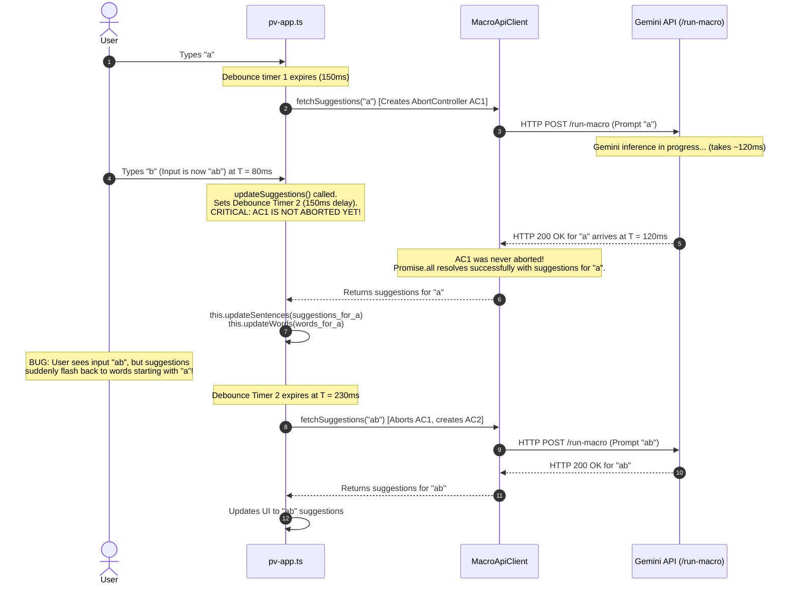
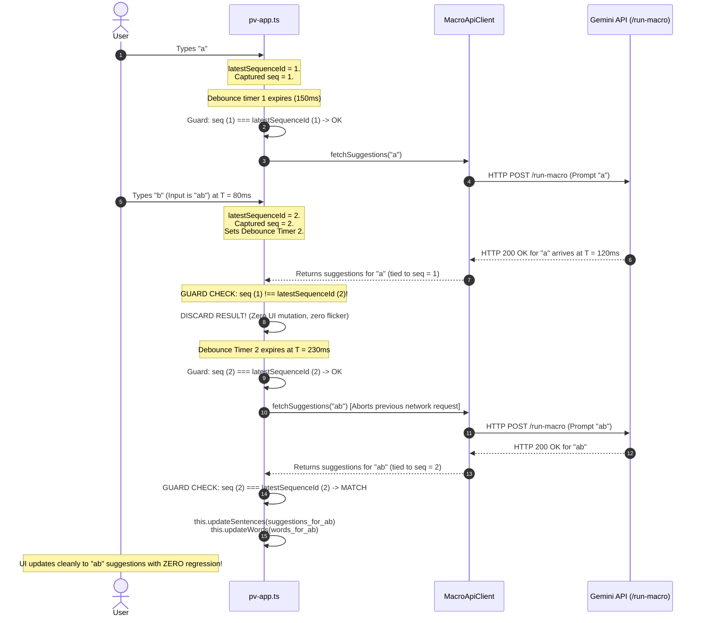

# Feature Brief: Monotonic Sequence Tagging for Suggestion Race-Condition Elimination

**Status:** Proposed  
**Last Updated:** 2026-08-26  
**Author:** Project VOICE Core Team  
**Component:** Frontend (`src/pv-app.ts`)  
**Target Release:** Immediate Pre-Refactor (Quick-Win P0) / Prerequisite for On-Device LLM Milestone M1  
**Effort Estimate:** S–M (1–2 engineer-days)  
**Related Docs:** [`docs/on-device-llm-design.md`](./on-device-llm-design.md)

---

## 1. Executive Summary

In Project VOICE, predictive word and sentence suggestions are generated asynchronously as the user types. Under the current production architecture, requests are sent over HTTP to the Python backend and forwarded to the Google Gemini API. Under the upcoming on-device architecture, suggestions will be generated client-side by a Web-compatible Gemma model running inside a Web Worker via WebGPU.

In both paradigms, asynchronous generation inherently introduces **race conditions**: when the user types rapidly or changes context, asynchronous responses can arrive out of order, or an obsolete in-flight request can resolve and overwrite fresh suggestions in the user interface (UI). 

Although the current client utilizes an `AbortController` in `MacroApiClient` alongside dynamic debounce timers in `pv-app.ts`, **these mechanisms fail to protect against several critical race conditions**—most notably the **Debounce-Window In-Flight Race**, the **Post-Resolution Settlement Race**, and the **Local Cache Inversion Race**.

This feature brief proposes introducing **Monotonic Sequence Tagging** as a lightweight, zero-dependency, presentation-layer synchronization contract. By tagging every input mutation with a monotonically increasing sequence identifier, the UI guarantees that **only responses corresponding to the user's latest interaction are ever permitted to render**. 

By extracting this fix into an independent, pre-on-device task, we:
1. **Immediately eliminate UI flickering and suggestion regressions** in the existing Gemini cloud production flow.
2. **Establish a unified, battle-tested scheduling contract** that the upcoming On-Device LLM runtime (LiteRT-LM Web) will inherit seamlessly.

---

## 2. Problem Statement: The AAC User Experience & UI Regression

Project VOICE serves individuals with motor and speech disabilities (e.g., ALS, cerebral palsy, spinal trauma). These users often communicate using assistive input devices such as eye-tracking cameras, switch access hardware, or specialized virtual keyboards.

In this operating environment, the reliability and predictability of predictive text are paramount:
- **High Keystroke Cost:** For switch-scanning or eye-gaze users, selecting a character or navigating to a suggestion candidate requires significant physical effort and time.
- **Cognitive Disruption from UI Flickering:** When a user types a new character (e.g., transitions from `"hel"` to `"help"`), having the suggestions momentarily update to `"helpful"` and `"helping"`, only to be abruptly clobbered 50ms later by delayed suggestions for `"hel"` (`"hello"`, `"helmet"`), is severely disorienting.
- **Accidental Erroneous Selection:** In switch-scanning mode, the scanner automatically steps through suggestions on a timer. If an outdated response clobbers the suggestions just as the switch is pressed, the user inadvertently speaks or types an unintended word, forcing an arduous correction cycle.

---

## 3. Current Architecture & Existing Race-Mitigation Mechanisms

Currently, suggestion lifecycle management is split between `src/pv-app.ts` (orchestration and UI) and `src/macro-api-client.ts` (network client).

```text
User Keystroke ──► pv-app.ts (Debounce & State) ──► MacroApiClient.ts (fetch & AbortController) ──► /run-macro (Gemini)
```

The current codebase attempts to mitigate concurrency issues using three mechanisms:

### 3.1 Mechanism 1: Dynamic Debounce with Adaptive Backoff (`pv-app.ts`)
When the user types, `pv-app.ts` does not immediately dispatch a network request. Instead, it resets a timer:

```typescript
// src/pv-app.ts
private delayBeforeFetchMs() {
  // Returns delay scaling from 0ms to 300ms based on recent QPS
  return Math.min(150 * (this.prevCallsMs.length - 1), 300);
}

async updateSuggestions() {
  window.clearTimeout(this.timeoutId);
  ...
  this.timeoutId = window.setTimeout(async () => {
    ...
    const result = await this.apiClient.fetchSuggestions(...);
    ...
  }, this.delayBeforeFetchMs());
}
```

### 3.2 Mechanism 2: Preemptive Request Abortion via Single-Instance `AbortController` (`macro-api-client.ts`)
`MacroApiClient` maintains a single class-level `AbortController` instance. When a new fetch is initiated, it aborts the preceding controller before creating a new one:

```typescript
// src/macro-api-client.ts
export class MacroApiClient {
  private fetchAbortController: AbortController | null = null;

  async fetchSuggestions(...) {
    // Abort prior in-flight fetch
    this.fetchAbortController?.abort();
    this.fetchAbortController = new AbortController();
    const abortSignal = this.fetchAbortController.signal;

    const wordsFetch = MacroApiClient.fetchSuggestion(..., abortSignal, ...);
    const sentencesFetch = MacroApiClient.fetchSuggestion(..., abortSignal, ...);

    const result = Promise.all([sentencesFetch, wordsFetch]).catch(err => {
      if (err instanceof DOMException) {
        console.log('Request was aborted by user:', userInputs);
      } else {
        alert(`Failed to access Gemini server or ${err || 'something'}.`);
      }
      return null;
    });

    return result;
  }
}
```

### 3.3 Mechanism 3: Blank Fast-Abort (`pv-app.ts`)
If the user deletes all text, `pv-app.ts` explicitly calls `this.apiClient.abortFetch()` and immediately clears suggestions:

```typescript
// src/pv-app.ts
if (isBlankAtCall) {
  if (!hasHistoryOrMemory) {
    this.apiClient.abortFetch();
    this.suggestions = [];
    this.words = [];
    return;
  }
}
```

---

## 4. Why Existing Mechanisms Fail: In-Depth Technical Breakdown

While the combination of debounce and `AbortController` catches simple, slow-typing scenarios, it leaves **critical edge cases completely unprotected**.

### 4.1 Failure Mode 1: The Debounce-Window In-Flight Race (The Most Common Bug)

The single greatest flaw in the current architecture is that **cancellation is coupled to the *dispatch* of the subsequent request, rather than the *keystroke* that invalidated the previous request**.

Consider the following chronological execution sequence:



#### The Root Cause
When the user types `"b"`, `window.clearTimeout(this.timeoutId)` cancels the pending timeout, but **it does not call `apiClient.abortFetch()`**. As a result, Request 1 remains active on the wire during the entire 150–300ms debounce window. If the server responds within that window, Request 1 resolves cleanly and renders suggestions for `"a"`, overwriting the display while the user is looking at `"ab"`.

---

### 4.2 Failure Mode 2: The "Just-Too-Late" Abort / Post-Resolution Settlement

Under the WHATWG Fetch standard, an `AbortSignal` only interrupts a request while the underlying network stream is unsettled.

```typescript
const text = fetch(url, { signal: abortSignal })
  .then(async res => {
    const textResponse = await res.text(); // Once body bytes are received, fetch resolves!
    return JSON.parse(textResponse);
  })
  .then(extractText);
```

1. Request 1 finishes downloading the HTTP response body. The browser's network task resolves the fetch promise and schedules the continuation microtasks (`res.text()`, `JSON.parse()`, `extractText()`).
2. Concurrently, before those microtasks finish executing, a new keystroke arrives, invoking `fetchAbortController?.abort()`.
3. **The Flaw:** Calling `abort()` on an already resolved `fetch` promise is a **complete no-op**. The browser will *not* retroactively throw a `DOMException: AbortError`.
4. The remaining promise chain resolves, returns the outdated suggestions, and updates the UI.

---

### 4.3 Failure Mode 3: Local Memory Cache Inversion Race

`pv-app.ts` caches initial suggestions for blank/starting inputs:

```typescript
// src/pv-app.ts (Lines 678-690)
const cacheEntry = this.cachedInitialSuggestionsByLanguage.get(languageKey);
if (cacheEntry && cacheEntry.historyKey === historyKey) {
  this.suggestions = cacheEntry.suggestions;
  this.words = [];
  this.requestUpdate();
  return; // Exits synchronously without calling apiClient!
}
```

1. The user types a character; an asynchronous request to Gemini is dispatched.
2. The user quickly deletes the character or switches language back to an initial state that hits the local cache.
3. The cache branch executes synchronously: it updates `this.suggestions` with cached entries and exits immediately.
4. **The Flaw:** Because `apiClient.fetchSuggestions()` was never invoked, **`this.fetchAbortController?.abort()` was never called**.
5. The slow in-flight network request from step 1 eventually returns and blindly overwrites the cached suggestions with obsolete results.

---

### 4.4 Failure Mode 4: Lack of State-Request Identity Correlation

In the current code, responses returned by `MacroApiClient.fetchSuggestions()` are pure data tuples:
```typescript
Promise<[string[], string[]] | null>
```
The response carries no correlation ID, sequence number, timestamp, or reference to the input state that triggered it. Once the promise resolves, `pv-app.ts` has no programmatic way to verify whether the incoming payload matches the active editor state.

---

### 4.5 Failure Mode 5: Forward Incompatibility with On-Device LLMs

The upcoming On-Device LLM feature ([`docs/on-device-llm-design.md`](./on-device-llm-design.md)) executes Gemma models in a dedicated Web Worker via WebGPU:
- Model inference is **token-by-token and streamed** via `postMessage`.
- WebGPU compute passes submitted to the browser command queue cannot be canceled mid-execution with millisecond precision.
- Worker-to-main-thread message queues introduce asynchronous buffering delays.

Even when LiteRT-LM's conversation cancellation API is triggered, tokens that were already queued in transit across the `postMessage` boundary will arrive at the main thread after the cancellation call. Without a strict sequence check on the main thread, these late-arriving tokens will leak into the UI.

---

## 5. The Proposal: Monotonic Sequence Tagging

We propose implementing **Monotonic Sequence Tagging** directly at the orchestration layer in `src/pv-app.ts`.

### 5.1 Conceptual Architecture

```text
                                        ┌───────────────────────────────┐
                                        │        latestSequenceId       │
                                        │  (Monotonically incrementing) │
                                        └───────────────┬───────────────┘
                                                        │
                      User Event (Typing, Backspace, Emotion, Language)
                                                        │
                                                        ▼
                                           sequenceId = ++latestSequenceId
                                                        │
                      ┌─────────────────────────────────┴─────────────────────────────────┐
                      ▼                                                                   ▼
              [Cache Hit Path]                                                  [Async / Network Path]
                      │                                                                   │
    Gate 1: sequenceId === latestSequenceId?                             Gate 2: sequenceId === latestSequenceId?
            ├── Yes ──► Render UI                                                ├── Yes ──► Dispatch fetch/Worker
            └── No  ──► Discard                                                  └── No  ──► Discard
                                                                                          │
                                                                                    Wait for Response
                                                                                          │
                                                                        Gate 3: sequenceId === latestSequenceId?
                                                                                 ├── Yes ──► Render UI
                                                                                 └── No  ──► Discard
```

### 5.2 Core Invariant
> **The UI Consistency Invariant:**  
> A suggestion result is eligible to update application state if and only if its associated `sequenceId` is strictly equal to the application's current `latestSequenceId` at the moment of mutation.

### 5.3 Synergistic Dual-Layer Defense: `AbortController` + `Sequence Tagging`

Sequence Tagging does **not** replace `AbortController`; rather, they form an optimal dual-layer defense:

| Layer | Component | Primary Responsibility | Failure Boundary |
|---|---|---|---|
| **Layer 1: Transport & Compute** | `AbortController` (Network) / `Conversation.cancel()` (WebGPU) | **Resource Efficiency:** Stop HTTP socket downloads, release server/API quota, and abort GPU tensor compute passes as early as possible. | Cannot protect against debounce gaps, resolved microtask interleaving, or cache collisions. |
| **Layer 2: View & State** | `Sequence Tagging` (`latestSequenceId`) | **Presentation Consistency:** Guarantee that no outdated data can ever mutate the UI, regardless of transport timing anomalies, cancellation lag, or caching. | Does not stop network or GPU compute by itself. |

---

## 6. Sequence Flow with Monotonic Sequence Tagging

The following diagram illustrates how the Debounce Window Race (Failure Mode 1) is completely resolved by Sequence Tagging:



---

## 7. Alternatives Considered & Comparative Analysis

| Dimension | Option 0: Current Baseline (`AbortController` Only) | Option 1: Eager Abort on Keydown | Option 2: Text Matching (`res.text === currentText`) | Option 3: Timestamp Ordering (`Date.now()`) | **Option 4: Monotonic Sequence Tagging (Proposed)** |
|---|---|---|---|---|---|
| **Eliminates Debounce Window Race** | ❌ No | ⚠️ Partial (doesn't fix fast server response) | ⚠️ Partial | ✅ Yes | ✅ **Yes** |
| **Eliminates Post-Fetch Settlement Race** | ❌ No | ❌ No | ✅ Yes | ✅ Yes | ✅ **Yes** |
| **Eliminates Cache Inversion Race** | ❌ No | ❌ No | ❌ No | ⚠️ Partial | ✅ **Yes** |
| **Handles Non-Text Context (Emotion, Lang, Persona)** | ❌ No | ❌ No | ❌ **Fails** (text identical, context differs) | ✅ Yes | ✅ **Yes** |
| **Handles Fast Undo/Redo/Re-type ("a" -> "" -> "a")** | ❌ No | ❌ No | ❌ **Fails** (text matches, but is old request) | ⚠️ Sensitive to clock resolution | ✅ **Yes (Guaranteed unique per action)** |
| **Forward Compatible with Web Worker / WebGPU Stream** | ❌ No | ❌ No | ⚠️ Partial | ⚠️ Partial | ✅ **Yes (Native fit for streaming chunks)** |
| **Runtime Overhead** | None | Low | String equality checks (allocations) | Clock system calls | **Negligible (single integer increment & comparison)** |

### Deep Dive into Rejected Alternatives

#### Alternative 1: Eager Abort on Keydown (Pre-Debounce Abort)
- *Description:* Call `this.apiClient.abortFetch()` immediately at the start of `updateSuggestions()` before setting `window.setTimeout`.
- *Why Rejected:* While this shrinks the race window, it fails when the previous HTTP response has already resolved (Failure Mode 2). Furthermore, aborting network requests too aggressively during fast typing prevents warm socket reuse and cancels requests that could have served as useful partial completions.

#### Alternative 2: Text Matching / Text Echo Verification
- *Description:* Echo the requested text in the response and check `if (this.stateInternal.text === responseText)`.
- *Why Rejected:* 
  1. **Non-Text Triggers:** In Project VOICE, suggestions are updated not only by typing, but also by clicking emotion chips, switching conversation modes, or toggling language. If text remains `"hello"` but emotion changes from `"happy"` to `"urgent"`, text matching cannot detect that a response was computed under the previous emotion.
  2. **The Re-type Trap:** If a user types `"cat"`, backspaces to `"ca"`, and types `"t"` again, text matching would incorrectly treat an in-flight response from the *first* `"cat"` as valid for the *second* `"cat"`, even though the conversation history, emotion, or timing shifted.

#### Alternative 3: Timestamp-Based Ordering (`Date.now()`)
- *Description:* Record a creation timestamp on the request and verify `if (responseTimestamp >= this.latestTimestamp)`.
- *Why Rejected:* JavaScript `Date.now()` is not strictly monotonic. Consecutive events fired within the same millisecond tick can share timestamps. Monotonic integer increments guarantee a strict total order with zero ambiguity.

---

## 8. Detailed Implementation Plan

The implementation is surgical and requires modifications primarily to `src/pv-app.ts`.

### 8.1 Step 1: Add Monotonic Counter to `PvApp`

In `src/pv-app.ts`:

```typescript
export class PvApp extends LitElement {
  ...
  // Monotonically increasing identifier for suggestion requests
  private latestSequenceId = 0;
```

### 8.2 Step 2: Instrument `updateSuggestions()` with Triple-Gate Checks

Update `updateSuggestions()` in `src/pv-app.ts` to assign and verify the sequence ID:

```typescript
  async updateSuggestions() {
    window.clearTimeout(this.timeoutId);

    // 1. Immediately increment the sequence ID upon any user-initiated trigger
    const sequenceId = ++this.latestSequenceId;

    const now = Date.now();
    this.prevCallsMs.push(now);
    this.prevCallsMs = this.prevCallsMs.filter(item => item > now - 1000);

    const historyKey = formatConversationHistory(
      this.conversationHistory,
      Date.now() - CONVERSATION_HISTORY_MAX_AGE_MS,
      CONVERSATION_HISTORY_MAX_TURNS,
    );
    let memoryKey = '';
    const hasHistoryOrMemory = historyKey.length > 0 || memoryKey.length > 0;
    const isBlankAtCall = this.isBlank();
    const languageKey = this.stateInternal.lang.promptName;

    if (isBlankAtCall) {
      if (!hasHistoryOrMemory) {
        this.apiClient.abortFetch();
        this.isLoading = false;
        this.suggestions = [];
        this.words = [];
        return;
      }

      // Check cache
      const cacheEntry =
        this.cachedInitialSuggestionsByLanguage.get(languageKey);
      if (
        cacheEntry &&
        cacheEntry.historyKey === historyKey &&
        cacheEntry.memoryKey === memoryKey
      ) {
        // GATE 1: Check cache validity against latest sequence ID
        if (sequenceId !== this.latestSequenceId) {
          return;
        }
        this.suggestions = cacheEntry.suggestions;
        this.words = [];
        this.requestUpdate();
        return;
      }
    }

    this.timeoutId = window.setTimeout(async () => {
      // GATE 2: Pre-dispatch check (has user typed while debounce timer was ticking?)
      if (sequenceId !== this.latestSequenceId) {
        return;
      }

      this.inFlightRequests++;
      this.isLoading = true;
      const [firstHalf, secondHalf] = splitLastFewSentencesForLLM(
        this.stateInternal.text,
      );

      const sentenceMacroId =
        this.state.features.sentenceMacroId ??
        this.stateInternal.sentenceMacroId;
      const wordMacroId =
        this.state.features.wordMacroId ?? this.stateInternal.wordMacroId;

      if (!sentenceMacroId || !wordMacroId) {
        console.error(
          'Macro IDs are not properly configured. Please check src/constants.ts or src/language.ts.',
          this.state.aiConfig,
          sentenceMacroId,
          wordMacroId,
        );
      }

      const result = await this.apiClient.fetchSuggestions(
        secondHalf,
        this.stateInternal.lang.promptName,
        this.stateInternal.model,
        {
          sentenceMacroId,
          wordMacroId,
          persona: this.stateInternal.persona,
          lastInputSpeech: this.state.lastInputSpeech,
          lastOutputSpeech: this.state.lastOutputSpeech,
          conversationHistory: historyKey,
          sentenceEmotion: this.state.emotion,
        },
      );

      this.inFlightRequests--;
      if (this.inFlightRequests === 0) {
        this.isLoading = false;
      }

      // GATE 3: Post-fetch check (did user type or trigger action while network request was in-flight?)
      if (sequenceId !== this.latestSequenceId) {
        return;
      }

      if (!result) {
        return;
      }

      const [sentenceValues, words] = result;
      const sentences = sentenceValues.map(
        s =>
          new SentenceSuggestion(
            SentenceSuggestionSource.LLM,
            firstHalf + ignoreUnnecessaryDiffs(secondHalf, s),
          ),
      );
      this.updateSentences(sentences);
      this.updateWords(words);

      if (isBlankAtCall) {
        this.cachedInitialSuggestionsByLanguage.set(languageKey, {
          suggestions: sentences,
          historyKey: historyKey,
          memoryKey: memoryKey,
        });
      }

      this.requestUpdate();
    }, this.delayBeforeFetchMs());
  }
```

> **Important note on `inFlightRequests`:** Gate 3 is placed *after* the `inFlightRequests--` and `isLoading` bookkeeping. This ensures the loading spinner is correctly cleared even when a stale response is discarded. Gate 2 is placed *before* the `inFlightRequests++`, so the counter is never incremented for requests that are discarded before dispatch.

### 8.3 Step 3: Forward Integration with On-Device LLM Milestone M1

When the On-Device LLM architecture is introduced, `SuggestionProviderRouter` will implement the same contract:

```typescript
// Proposed interface in docs/on-device-llm-design.md
interface SuggestionRequest {
  sequenceId: number; // Passed from pv-app.ts
  text: string;
  ...
}

interface SuggestionResult {
  sequenceId: number; // Echoed back by provider
  sentences: string[];
  words: string[];
  ...
}
```

Whether suggestions originate from `CloudSuggestionProvider` or `LocalSuggestionProvider` (Web Worker), `pv-app.ts` evaluates the identical gate:
```typescript
if (result.sequenceId !== this.latestSequenceId) {
  // Discard stale token stream or completion
  return;
}
```

---

## 9. Verification & Testing Strategy

To ensure zero regressions and mathematically verify race-condition elimination, we establish both automated unit tests and manual verification protocols.

### 9.1 Automated Jasmine Unit Tests (`src/tests/test_pv-app.ts`)

We will add a dedicated test suite in `src/tests/test_pv-app.ts` utilizing deferred promises to simulate network latency inversion:

```typescript
describe('PvApp Sequence Tagging & Race Condition Mitigation', () => {
  let app: PvApp;
  let mockApiClient: any;

  beforeEach(() => {
    app = new PvApp();
    mockApiClient = {
      fetchSuggestions: jasmine.createSpy('fetchSuggestions'),
      abortFetch: jasmine.createSpy('abortFetch'),
    };
    (app as any).apiClient = mockApiClient;
  });

  it('discards stale suggestions when a newer request completes first (out-of-order resolution)', async () => {
    let resolveFirstRequest: Function;
    let resolveSecondRequest: Function;

    const firstPromise = new Promise(resolve => {
      resolveFirstRequest = resolve;
    });
    const secondPromise = new Promise(resolve => {
      resolveSecondRequest = resolve;
    });

    mockApiClient.fetchSuggestions.and.callFake((text: string) => {
      if (text === 'first') return firstPromise;
      if (text === 'second') return secondPromise;
      return Promise.resolve(null);
    });

    // 1. Trigger first request
    (app as any).stateInternal.text = 'first';
    app.updateSuggestions();
    jasmine.clock().tick(300); // Trigger debounce timeout

    // 2. Trigger second request while first is still pending
    (app as any).stateInternal.text = 'second';
    app.updateSuggestions();
    jasmine.clock().tick(300); // Trigger debounce timeout

    // 3. Resolve SECOND request first
    resolveSecondRequest!([['Sentence for second'], ['secondWord']]);
    await secondPromise;
    expect(app.words).toEqual(['secondWord']);

    // 4. Resolve FIRST request afterwards (stale arrival)
    resolveFirstRequest!([['Sentence for first'], ['firstWord']]);
    await firstPromise;

    // 5. Verify UI was NOT overwritten by the stale first response
    expect(app.words).toEqual(['secondWord']);
    expect((app as any).suggestions[0].text).toContain('Sentence for second');
  });

  it('discards in-flight response if user cleared input during request execution', async () => {
    let resolveRequest: Function;
    const pendingPromise = new Promise(resolve => {
      resolveRequest = resolve;
    });

    mockApiClient.fetchSuggestions.and.returnValue(pendingPromise);

    (app as any).stateInternal.text = 'hello';
    app.updateSuggestions();
    jasmine.clock().tick(300);

    // User clears text before fetch completes
    (app as any).stateInternal.text = '';
    app.updateSuggestions();

    // In-flight fetch resolves
    resolveRequest!([['Hello there'], ['hello']]);
    await pendingPromise;

    // Words and suggestions must remain empty
    expect(app.words).toEqual([]);
    expect(app.suggestions).toEqual([]);
  });

  it('prevents stale in-flight response from overwriting memory cache hit', async () => {
    let resolveRequest: Function;
    const pendingPromise = new Promise(resolve => {
      resolveRequest = resolve;
    });

    mockApiClient.fetchSuggestions.and.returnValue(pendingPromise);

    // 1. In-flight request for typed word
    (app as any).stateInternal.text = 'typing';
    app.updateSuggestions();
    jasmine.clock().tick(300);

    // 2. Set mock cache and trigger blank call
    (app as any).cachedInitialSuggestionsByLanguage.set('en', {
      suggestions: [new SentenceSuggestion(SentenceSuggestionSource.LLM, 'Cached Sentence')],
      historyKey: '',
      memoryKey: '',
    });
    (app as any).stateInternal.text = '';
    app.updateSuggestions(); // Hits cache synchronously

    expect((app as any).suggestions[0].text).toBe('Cached Sentence');

    // 3. Late network request resolves
    resolveRequest!([['Overwriting sentence'], ['overwritingWord']]);
    await pendingPromise;

    // Cache must remain intact
    expect((app as any).suggestions[0].text).toBe('Cached Sentence');
  });
});
```

### 9.2 Manual QA Checklist
1. **High-Speed Typing Simulation:** Type `hello world` at 80+ WPM. Verify in DevTools Network panel that multiple requests are created/aborted, but the suggestions UI smoothly tracks the input without retrogressing to earlier prefixes.
2. **Rapid Backspace & Re-type:** Type `cat`, rapidly hit Backspace twice to `c`, then re-type `ar` (`car`). Verify suggestion list shows car-related predictions, not cat-related predictions.
3. **Switch & Emotion Jitter:** Type a word, rapidly click between emotion chips (`Happy`, `Urgent`, `Neutral`). Verify suggestions reflect the final selected emotion, with no flicker from prior selections.
4. **Language Switch:** Type a partial word, switch language, verify suggestions update without stale cross-language results.
5. **Loading Spinner:** Verify the spinner correctly appears and disappears, even when stale responses are discarded (no stuck spinner).

---

## 10. Success Metrics & Acceptance Criteria

### 10.1 Key Metrics
- **Stale Overwrite Rate:** Exactly **0%** in automated concurrency test suites.
- **UI Render Overhead:** **0 ms added latency** (JavaScript integer comparison takes $< 1 \mu s$).
- **Memory Footprint:** 8 bytes per app instance for the integer counter; zero object allocations.
- **Network Bandwidth Impact:** **0% increase** (leverages existing `AbortController` for transport termination).

### 10.2 Acceptance Criteria
- [ ] `latestSequenceId` is incremented synchronously on every `updateSuggestions()` invocation.
- [ ] Gate 1 (Cache), Gate 2 (Pre-dispatch timeout), and Gate 3 (Post-fetch completion) enforce `sequenceId === this.latestSequenceId`.
- [ ] `inFlightRequests` bookkeeping executes regardless of gate results (no stuck loading spinner).
- [ ] All unit tests in `src/tests/test_pv-app.ts` pass (`npm test`).
- [ ] Cloud (Gemini) suggestion flow exhibits zero UI regressions under rapid typing.
- [ ] Code changes cleanly merge into `main` without modifying backend API signatures.

---

## 11. Effort Estimate & Scope

### 11.1 Estimated Effort

| Task | Effort | Notes |
|---|---|---|
| Add `latestSequenceId` and triple-gate checks in `src/pv-app.ts` | **XS** (< 0.5 day) | ~15 lines of new code; purely additive. |
| Write Jasmine unit tests in `src/tests/test_pv-app.ts` | **S** (0.5–1 day) | 3–5 test scenarios using deferred promises. |
| Manual QA validation | **XS** (< 0.5 day) | Rapid typing, backspace, emotion, and language scenarios. |
| Code review and merge | **XS** (< 0.5 day) | Frontend-only change; no backend review needed. |
| **Total** | **S–M (1–2 days)** | |

### 11.2 Files Changed

| File | Change Type | Description |
|---|---|---|
| `src/pv-app.ts` | Modified | Add `latestSequenceId` field; add three gate checks in `updateSuggestions()`. |
| `src/tests/test_pv-app.ts` | Modified | Add `describe('Sequence Tagging')` test suite. |

### 11.3 Files NOT Changed

| File | Reason |
|---|---|
| `src/macro-api-client.ts` | `AbortController` logic retained as-is for transport efficiency. |
| `main.py` / `macro.py` | No backend changes. Sequence ID is entirely client-side. |
| `templates/prompts/*.jinja2` | No prompt changes. |
| `package.json` / `pyproject.toml` | No new dependencies. |

---

## 12. Conclusion & Next Steps

Monotonic Sequence Tagging is an elegant, robust, and minimally invasive solution to a persistent race-condition problem in Project VOICE. 

By addressing this issue now as an independent task:
1. We immediately elevate the typing reliability and accessibility standards for existing users.
2. We lay a rock-solid foundation for the upcoming On-Device LLM (LiteRT-LM) milestone, ensuring that streaming local tokens and cloud completions adhere to the exact same predictable synchronization semantics.

### Recommended Next Action
1. Review and approve this Feature Brief.
2. Open a focused PR implementing the proposed changes in `src/pv-app.ts` alongside the corresponding Jasmine tests in `src/tests/test_pv-app.ts`.
